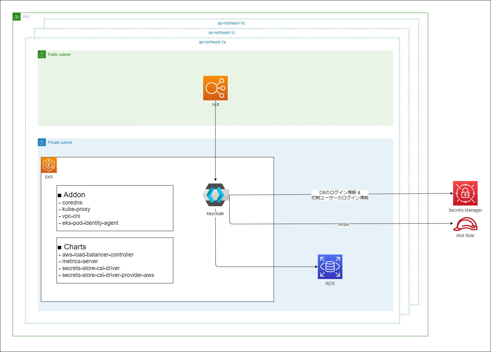

# Terraform EKS チュートリアル

- [Chapter1 Terraform入門](docs/chapter_01.md)
- [Chapter2 EKSクラスタ作成](docs/chapter_02.md)
- [Chapter3 Helmでチャートをインストール](docs/chapter_03.md)
- [Chapter4 Keycloakの構築](docs/chapter_04.md)
