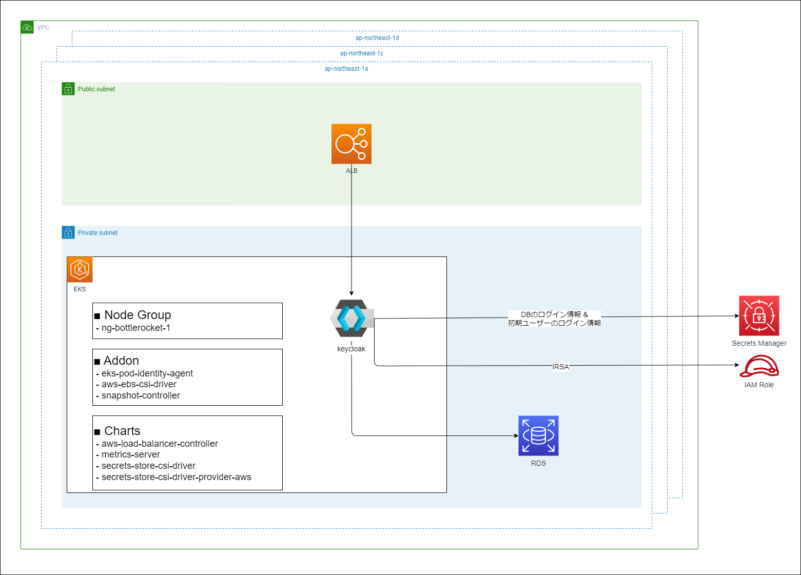

# Terraform x EKS チュートリアル

このチュートリアルではTerraformを利用してEKSクラスタの構築・運用を行う方法を学びます。

- [Chapter1 Terraform入門](docs/chapter_01.md)
- [Chapter2 設計・環境構築](docs/chapter_02.md)
- [Chapter3 ネットワーク作成](docs/chapter_03.md)
- [Chapter4 クラスタ作成](docs/chapter_04.md)
- [Chapter5 ノードグループ作成](docs/chapter_05.md)
- [Chapter6 アドオンインストール](docs/chapter_06.md)
- [Chapter7 プラグインインストール](docs/chapter_07.md)
- [Chapter8 keycloakの構築](docs/chapter_08.md)
- [Chapter9 リソースの削除](docs/chapter_09.md)