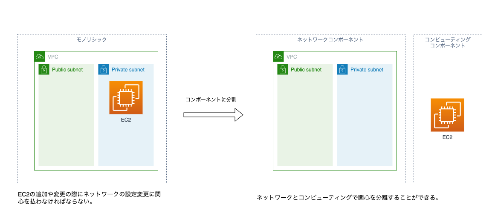
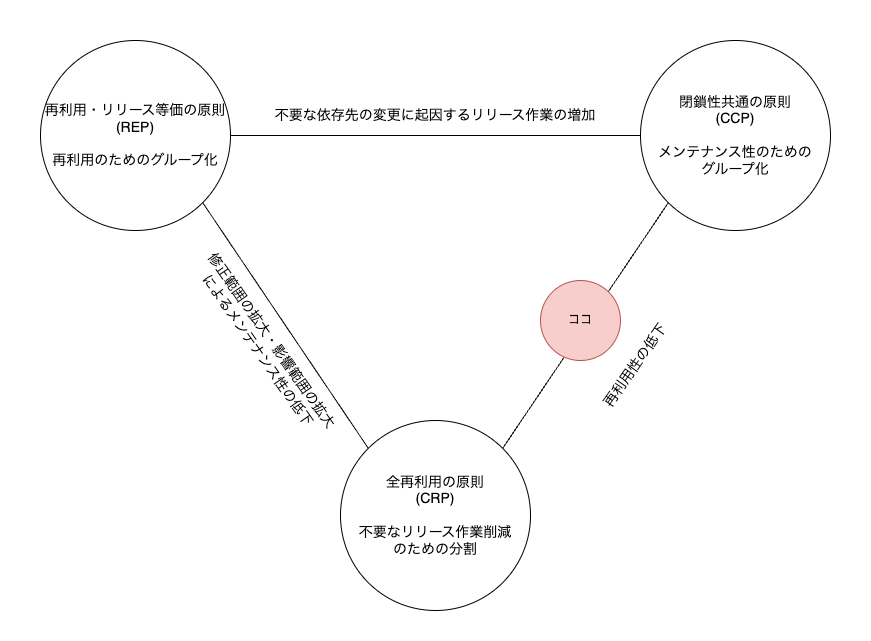

Chapter1 設計・環境構築
---
[READMEに戻る](../README.md)

# ■ 設計

Terraformを実装し始める前に設計について少し考えてみましょう。  

Terraformは最初にデプロイして終わりではありません。サービスが続く限り日々更新・デプロイされます。更新はサービス自体の構成変更の場合もありますし、Terraformやプロバイダのアップデートの場合もあります。  
このように長期間運用されるシステムでは、時間経過とともに発生する様々な変更に耐えられる設計を考える必要があり、この設計の如何によっては、運用の崩壊や障害の増加といったリスクが高まることになります。

## モノリシックなTerraformの問題点

Terraformでは1度の `terraform apply` でシステムすべてを構築することも可能ですが、実際の運用ではその手法は避けるべきです。

その理由として、TerraformはTerraform自体のアップデートやプロバイダが頻繁にアップデートされるため、そのアップデート内容によっては既存のリソースに意図せぬリリースが行われる可能性があります。また、構成変更の際にリソース同士の依存関係によって意図せぬリリースが発生することもあります。  
意図せぬリリースが発生すると、最悪既存のリソースが再作成されてサービスが止まったり、データが消失したりします。

モノリシックな設計では、常に意図せぬリリースを考慮しながら実装しなければならず、これが起こった際の影響調査や解決は非常に難しくミスもしやすいため、長期的に見ると生産性が低下します。

この、意図せぬリリースをなるべく回避するにはリソースをある程度のまとまり(コンポーネント)に分割し、コンポーネント単位でデプロイする必要があります。  
コンポーネント単位でデプロイすることで、リリースの影響をコンポーネント内に限定することができます。  

### 例えば...

VPC, Subnet, EC2をデプロイするTerraformを考えると、モノリシックだとEC2の追加や変更を行う際に常にネットワークに変更が入らないかを考慮する必要がありますが、コンポーネントに分割するとそのような関心を払う必要がなくなります。

では、コンポーネントはどのように分割すればいいでしょうか。

## コンポーネントとは

まず、コンポーネントとは **「システムの一部として独立してデプロイ・再利用できる最小限のまとまり」** のことです。  
そして、コンポーネントには一貫したテーマや目的があり、コンポーネントの構成要素はコンポーネントの目的と関連性の高いものでなければなりません。

## コンポーネントの凝集性

> [!NOTE] コンポーネントの凝集性とは
> コンポーネントが担う責務や機能がどの程度のまとまりを持っているかを示す概念で、具体的には **「コンポーネントの責務が一つに絞り込まれているか」** **「構成要素がコンポーネントの責務と強い関連性を持っているか」** を図る指標となります。  
> 「高い」または「低い」で表します。
> 
>
> - **凝集性が高い**  
>   - 単一の責務に特化している
>   - メンテナンス性・再利用性が高い
>   - コンポーネントの責務を達成するための関連性の強い要素のみで構成されている
> - **凝集性が低い**  
>   - 複数の異なる責務を持っている
>   - 一つの変更に対する修正範囲が大きい
>   - コンポーネントの責務と関連性の薄い構成要素が雑多に詰め込まれている

コンポーネントの凝集性を評価するには3つの原則が材料となります。

1. **再利用・リリース等価の原則(REP)** (再利用性のためのグループ化)  
再利用可能な単位でひとまとめにすること
2. **閉鎖性共通の原則(CCP)** (保守性のためのグループ化)  
同じ理由、同じタイミングで変更されるものはひとまとめにすること
3. **全再利用の原則(CRP)** (不要なリリース作業を減らすための分割)  
不要なものに依存しないこと

### 再利用・リリース等価の原則(REP)

> *再利用の単位とリリースの単位は等価になる*

コンポーネントを再利用の単位で作成し、再利用の単位でリリースできるようにすることで、コンポーネントの再利用がしやすくなります。  

> [!CAUTION] この原則を無視すると...
> 再利用の際に複数のコンポーネントを参照しなければならなくなり、バージョンの互換性の考慮が発生するなど、再利用が難しくなります

### 閉鎖性共通の原則(CCP)

> *同じ理由、同じタイミングで変更されるクラスをコンポーネントにまとめること。変更の理由やタイミングが異なるクラスは別のコンポーネントに分けること。*

コンポーネントが、変更理由や変更タイミングが同じ要素で構成されていれば、一つの変更に対して一つのコンポーネントの変更とデプロイ行うだけで良くなります。  
つまり、変更に対して閉じている(=閉鎖性)ということです。

> [!CAUTION] この原則を無視すると...
> 同じ理由、同じタイミングで変更されるべきリソースが複数のコンポーネントに散らばっていると、一つの変更で複数のコンポーネントの修正が必要になります。(修正範囲の拡大)
> 異なる理由、異なるタイミングで変更されるべきリソースが同一コンポーネントにまとまっていると、一つの変更が関係ない機能に影響を及ぼす可能性があります。(影響範囲の拡大)
> どちらもメンテナンス性が低下します。

### 全再利用の原則(CRP)

> *コンポーネントのユーザーに対して、実際には使わないものへの依存を強要してはいけない*

コンポーネントが本当に必要な依存先にのみ依存することで、不要な依存先の変更に起因するリソースを避けることができます。

> [!CAUTION] この原則を無視すると...
> コンポーネントが不要な依存先に依存することで、不要な依存先の変更の影響ででリリースを強制されるようになります。

## コンポーネントの凝集性のテンション図

これら3つの原則はすべて遵守すべきといったものではありません。  
**再利用・リリース等価の原則(REP)** と **閉鎖性共通の原則(CCP)** はコンポーネントを大きくする方向に働き、 **全再利用の原則(CRP)** はコンポーネントを小さくする方向に働くといった点で3つの原則にはトレードオフな部分があり、どの原則を重視するかはプロダクトの状況によってバランスを取りながら変えていく必要があります。  
これら3つの原則のバランスを上手く取るのがアーキテクトの腕の見せ所です。

テンション図は3つの原則がそれぞれどのように影響を及ぼし合うかを示したもので、辺にある記述は反対側の頂点にある原則を無視したときにかかる **コスト** を表しています。

- **再利用・リリース等価の原則 (REP)** と **全再利用の原則 (CRP)** にだけ力を入れていると
  - 些細な修正で多くのコンポーネントの修正が必要になったり、一つの修正が関係のない他の機能に影響を及ぼします。
- **再利用・リリース等価の原則 (REP) ** と ** 閉鎖性共通の原則 (CCP)** にだけ力を入れていると
  - コンポーネントの依存先が増え、不要な依存先の変更に起因した不要なリリースが増加します。
- **全再利用の原則 (CRP)** と **閉鎖性共通の原則 (CCP)** にだけ力を入れていると
  - 再利用の単位が複数のコンポーネントにまたがり再利用しづらくなります。

## コンポーネントの結合

## Terraformにおけるコンポーネントの設計

TerraformにおけるコンポーネントではCCPとCRPを重視します。  
理由としてはTerraformにおいて、共通化による再利用性の向上は変更の影響範囲の拡大といった観点から悪手であることが多いので、再利用性を考慮する必要は殆どありません。  
メンテナンス性が向上することと、不要な依存によって不要なリリースが発生しないことが最も重要となります。  

