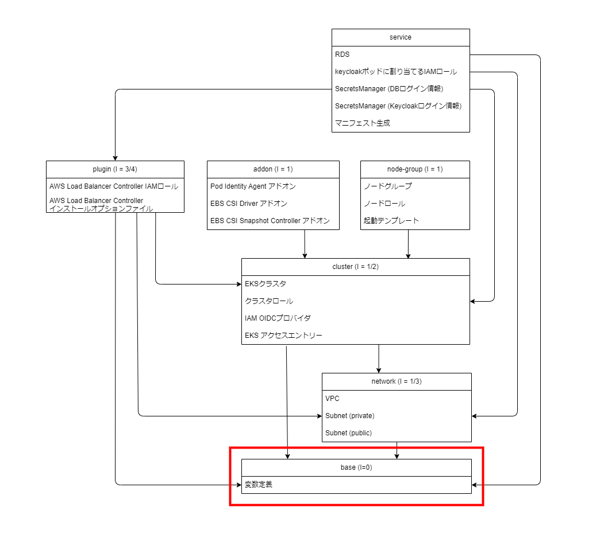

Chapter2 設計・環境構築
---
[READMEに戻る](../README.md)


# ■ 設計

Terraformを実装し始める前に設計について少し考えてみましょう。  

Terraformは最初にデプロイして終わりではありません。サービスが続く限り日々更新・デプロイされます。更新はサービス自体の構成変更の場合もありますし、Terraformやプロバイダのアップデートの場合もあります。  
このように長期間運用されるシステムでは、時間経過とともに発生する様々な変更に耐えられる設計を考える必要があり、この設計の如何によっては、運用の崩壊や障害の増加といったリスクが高まることになります。


## モノリシックなTerraformの問題点

Terraformでは1度の `terraform apply` でシステムすべてを構築することも可能ですが、実際の運用ではその手法は避けるべきです。

その理由として、TerraformはTerraform自体のアップデートやプロバイダが頻繁にアップデートされるため、そのアップデート内容によっては既存のリソースに意図せぬリリースが行われる可能性があります。また、構成変更の際にリソース同士の依存関係によって意図せぬリリースが発生することもあります。  
意図せぬリリースが発生すると、最悪既存のリソースが再作成されてサービスが止まったり、データが消失したりします。

モノリシックな設計では、常に意図せぬリリースを考慮しながら実装しなければならず、これが起こった際の影響調査や解決は非常に難しくミスもしやすいため、長期的に見ると生産性が低下します。

この、意図せぬリリースをなるべく回避するにはリソースをある程度のまとまり(コンポーネント)に分割し、コンポーネント単位でデプロイする必要があります。  
コンポーネント単位でデプロイすることで、リリースの影響をコンポーネント内に限定することができます。  

### 例えば...

VPC, Subnet, EC2をデプロイするTerraformを考えると、モノリシックだとEC2の追加や変更を行う際に常にネットワークに変更が入らないかを考慮する必要がありますが、コンポーネントに分割するとそのような関心を払う必要がなくなります。


では、コンポーネントはどのように分割すればいいでしょうか。


## コンポーネントとは

まず、コンポーネントとは **「システムの一部として独立してデプロイ・再利用できる最小限のまとまり」** のことです。  
そして、コンポーネントには一貫したテーマや目的があり、コンポーネントの構成要素はコンポーネントの目的と関連性の高いものでなければなりません。


## コンポーネントの凝集性 (コンポーネントに含める要素について)


> [!NOTE]
> #### コンポーネントの凝集性とは
>
> コンポーネントが担う責務や機能がどの程度のまとまりを持っているかを示す概念で、具体的には **「コンポーネントの責務が一つに絞り込まれているか」** **「構成要素がコンポーネントの責務と強い関連性を持っているか」** を図る指標となります。  
> 「高い」または「低い」で表します。
> 
>
> - **凝集性が高い**  
>   - 単一の責務に特化している
>   - メンテナンス性・再利用性が高い
>   - コンポーネントの責務を達成するための関連性の強い要素のみで構成されている
> - **凝集性が低い**  
>   - 複数の異なる責務を持っている
>   - 一つの変更に対する修正範囲が大きい
>   - コンポーネントの責務と関連性の薄い構成要素が雑多に詰め込まれている

コンポーネントの凝集性を評価するには3つの原則が材料となります。

1. **再利用・リリース等価の原則(REP)** (再利用性のためのグループ化)  
再利用可能な単位でひとまとめにすること
2. **閉鎖性共通の原則(CCP)** (保守性のためのグループ化)  
同じ理由、同じタイミングで変更されるものはひとまとめにすること
3. **全再利用の原則(CRP)** (不要なリリース作業を減らすための分割)  
不要なものに依存しないこと

### 再利用・リリース等価の原則(REP)

> *再利用の単位とリリースの単位は等価になる*

コンポーネントを再利用の単位で作成し、再利用の単位でリリースできるようにすることで、コンポーネントの再利用がしやすくなります。  

> [!CAUTION]
> #### この原則を無視すると...
> 再利用の際に複数のコンポーネントを参照しなければならなくなり、バージョンの互換性の考慮が発生するなど、再利用が難しくなります

### 閉鎖性共通の原則(CCP)

> *同じ理由、同じタイミングで変更されるクラスをコンポーネントにまとめること。変更の理由やタイミングが異なるクラスは別のコンポーネントに分けること。*

コンポーネントが、変更理由や変更タイミングが同じ要素で構成されていれば、一つの変更に対して一つのコンポーネントの変更とデプロイ行うだけで良くなります。  
つまり、変更に対して閉じている(=閉鎖性)ということです。

> [!CAUTION]
> #### この原則を無視すると...
> 同じ理由、同じタイミングで変更されるべきリソースが複数のコンポーネントに散らばっていると、一つの変更で複数のコンポーネントの修正が必要になります。(修正範囲の拡大)  
> 異なる理由、異なるタイミングで変更されるべきリソースが同一コンポーネントにまとまっていると、一つの変更が関係ない機能に影響を及ぼす可能性があります。(影響範囲の拡大)  
> どちらもメンテナンス性が低下します。


### 全再利用の原則(CRP)

> *コンポーネントのユーザーに対して、実際には使わないものへの依存を強要してはいけない*

コンポーネントが本当に必要な依存先にのみ依存することで、不要な依存先の変更に起因するリソースを避けることができます。


> [!CAUTION]
> #### この原則を無視すると...
> コンポーネントが不要な依存先に依存することで、不要な依存先の変更の影響ででリリースを強制されるようになります。

### コンポーネントの凝集性のテンション図

これら3つの原則はすべてを遵守すべきものではありません。  
**再利用・リリース等価の原則(REP)** と **閉鎖性共通の原則(CCP)** はコンポーネントを大きくする方向に働き、 **全再利用の原則(CRP)** はコンポーネントを小さくする方向に働くといった点で3つの原則にはトレードオフな部分があり、どの原則を重視するかはプロダクトの状況によってバランスを取りながら変えていく必要があります。  
これら3つの原則のバランスを上手く取るのがアーキテクトの腕の見せ所です。


テンション図は3つの原則がそれぞれどのように影響を及ぼし合うかを示したもので、辺にある記述は反対側の頂点にある原則を無視したときにかかる **コスト** を表しています。

- **再利用・リリース等価の原則 (REP)** と **全再利用の原則 (CRP)** にだけ力を入れていると
  - 些細な修正で多くのコンポーネントの修正が必要になったり、一つの修正が関係のない他の機能に影響を及ぼします。
- **再利用・リリース等価の原則 (REP) ** と ** 閉鎖性共通の原則 (CCP)** にだけ力を入れていると
  - コンポーネントの依存先が増え、不要な依存先の変更に起因した不要なリリースが増加します。
- **全再利用の原則 (CRP)** と **閉鎖性共通の原則 (CCP)** にだけ力を入れていると
  - 再利用の単位が複数のコンポーネントにまたがり再利用しづらくなります。


### Terraformにおけるコンポーネントの設計

立ち戻って、Terraformにおけるコンポーネントの凝集性を考えてみましょう。  
結論から言うと、Terraformでは**閉鎖性共通の原則 (CCP)** を最も重視し、次点で **全再利用の原則 (CRP)** を考慮します。  
理由としては、Terraformのプロジェクトにおいて「変更の際に影響範囲が限定されること」と「依存先の更新に起因する不要なリリースが発生しないこと」が最も重要だからです。  

反対に、「共通化による再利用性の向上」は重要ではありません。そもそもインフラは1点ものの場合が多いので再利用されることが殆どありませんし、共通化するということは共通部分を変更した際にそれを利用するすべてのコンポーネントでリリースが必要になるため、運用負荷も大きくなります。  

図で表すと、赤丸のポジションを目指すことになります。


## コンポーネントの結合 (コンポーネント同士の関係性)

コンポーネント同士の関係性についても3つの原則があります。

1. **非循環依存関係の原則(ADP)**
2. **安定依存の原則(SDP)**
3. **安定度・抽象度等価の原則(SAP)**

### 非循環依存関係の原則(ADP)
> *コンポーネントの依存グラフに循環依存があってはいけない*

### 安定依存の原則(SDP)
> *安定度の高い方向に依存すること*

> [!NOTE]
> #### 安定度とは
> 安定度(`I`)は `I = 依存している数 / (依存されている数 + 依存している数)` で計算します。  
> 値が小さいほど **安定** 、 値が大きいほど **不安定** となります。  
> - `I = 0` 最も安定
> - `I = 1` 最も不安定
>
> つまり、たくさん依存されているコンポーネントが **安定** で、逆に、他への依存が多いコンポーネントが **不安定** となります。

安定依存の原則(SDP)は、コンポーネントの `I` を依存するコンポーネントの `I` よりも大きくすべきであるという原則となります。  
つまり、コンポーネントの依存グラフを上からたどると `I` の値は **減少** していくべきだということになります。


誤解を恐れずにざっくりいうと、たくさんの依存されているコンポーネントは、なるべく他のコンポーネントに依存しないようにしましょうということです。

### 安定度・抽象度等価の原則(SAP)
> *コンポーネントの抽象度は、その安定度と同程度でなければいけない*

これは、安定したコンポーネントは抽象度も高くあるべき、不安定なコンポーネントは具象的であるべきという原則ですが、Terraformは抽象化ができないので説明を省きます。


## コンポーネント設計

今回のチュートリアルにおけるコンポーネントを設計していきます。

### コンポーネント作成

**全再利用の原則 (CRP)** と **閉鎖性共通の原則 (CCP)** に基づいて、コンポーネントはリソースの生存期間で分割します。  
※ 生存期間で分割するということは、同じタイミング作成・削除されるリソースにグルーピングするということになります。


| コンポーネント | 要素 |
| --- | --- |
| base | いろいろなコンポーネントで利用される共通変数など |
| network | VPC, サブネットなど |
| cluster | EKSクラスタ |
| node-group | EKSのノードグループ, 起動テンプレートなど |
| addon | EKSのアドオン |
| plugin | helmでインストールするチャートに付随するリソース |
| service | EKSにデプロイするサービスに付随するリソース |


### コンポーネントの結合


**非循環依存関係の原則(ADP)** と **安定依存の原則(SDP)** に基づいてコンポーネント同士を結合します。  
※ 循環依存しない、安定度の高いコンポーネントに依存するようにします。


# ■ 環境構築

## ツール類のインストール

Terraform, aws-cli, kubectl, k9s, helmなどのパッケージはdevcontainerに含まれています。  
インストール方法は [.devcontainer/Dockerfile](../.devcontainer/Dockerfile)を参照してください。

## ディレクトリ構成

チュートリアルのソースはすべて `tutorial` ディレクトリ配下に配置します。  

```bash
cd $PROJECT_DIR/tutorial
```

ディレクトリ構成

```
tutorial/
  plugin/
    albc/                       # helmでALBCをインストールするための手順やリソースなど
    metrics-server/             # helmでmetrics-serverをインストールするための手順やリソースなど
    secret-store-csi-driver/    # helmでsecret-store-csi-driverをインストールするための手順やリソースなど
  service/
    keycloak/                   # keycloakをEKSにデプロイするためのマニフェストファイルなど
  terraform/
    envs/                       # dev, stg, prd など、各環境のリソース作成のエントリーポイントとなるディレクトリを格納
      dev/
        base/                   # いろいろなコンポーネントで利用される共通変数など
        network/                # VPC, サブネットなど
        cluster/                # EKSクラスタ
        node-group/             # EKSのノードグループ, 起動テンプレートなど
        addon/                  # EKSのアドオン関連
        plugin/                 # helmでインストールするチャートに付随するリソース
        service/                # EKSにデプロイするサービスに付随するリソース
    modules/                    # サービス毎・ライフサイクル毎にある程度リソースをグループ化したモジュールを配置
      albc/                     # AWS Load Balancer Controllerのインストールと関連リソース定義
      cluster/                  # EKSクラスタ
      ebs-csi-driver/           # ebs-csi-driverに付随するリソース
      keycloak/                 # keycloakサービスに付随するリソース
      node-group-bottlerocket/  # bottlerocketのノードグループを作成するモジュール
```

## .gitignore配置

[Terraform.gitignore - gitignore | Github](https://github.com/github/gitignore/blob/main/Terraform.gitignore)

`terraform/.gitignore`

```ini
# Local .terraform directories
**/.terraform/*

# .tfstate files
*.tfstate
*.tfstate.*

# Crash log files
crash.log
crash.*.log

# Exclude all .tfvars files, which are likely to contain sensitive data, such as
# password, private keys, and other secrets. These should not be part of version 
# control as they are data points which are potentially sensitive and subject 
# to change depending on the environment.
*.tfvars
*.tfvars.json

# Ignore override files as they are usually used to override resources locally and so
# are not checked in
override.tf
override.tf.json
*_override.tf
*_override.tf.json

# Ignore transient lock info files created by terraform apply
.terraform.tfstate.lock.info

# Include override files you do wish to add to version control using negated pattern
# !example_override.tf

# Include tfplan files to ignore the plan output of command: terraform plan -out=tfplan
# example: *tfplan*

# Ignore CLI configuration files
.terraformrc
terraform.rc
```

# ■ baseコンポーネント作成

いろいろなコンポーネントで利用される変数を定義するbaseコンポーネントを作成します。



## tfstate管理用s3バケット作成

terraformのtfstateを管理するS3バケットを作成します。

```bash
# tfstateファイルをS3で管理する
# https://developer.hashicorp.com/terraform/language/settings/backends/s3
TFSTATE_BUCKET="terraform-tutorial-eks-tfstate"

aws s3api create-bucket \
  --bucket $TFSTATE_BUCKET \
  --region ap-northeast-1 \
  --create-bucket-configuration LocationConstraint=ap-northeast-1

```

## tfstateロック用のdynamodbテーブルを作成

terraformを複数個所から同時にデプロイできないように、dynamoDBにtfstateをロックするためのテーブルを作成します。

```bash
# tfstateファイルのロック情報をDynamoDBで管理する
# https://developer.hashicorp.com/terraform/language/settings/backends/s3#dynamodb-state-locking

TFSTATE_LOCK_TABLE="terraform-tutorial-eks-tfstate-lock"

aws dynamodb create-table \
    --table-name $TFSTATE_LOCK_TABLE \
    --attribute-definitions AttributeName=LockID,AttributeType=S \
    --key-schema AttributeName=LockID,KeyType=HASH \
    --provisioned-throughput ReadCapacityUnits=5,WriteCapacityUnits=5 \
    --region ap-northeast-1
```

## tfstateとプロバイダの設定

※ `EDIT: ...` コメントの項目を各自編集してください

- `terraform`
  - `required_version`  
  インストールしてあるTerraformのバージョンを指定します。 ( `terraform --version` )
  - `backend`  
  terraformではリソースを `terraform.tfstate` というファイルで管理しますが、デフォルトだとこのファイルはローカルに生成されてしまうため、s3バケットに保存するように設定します。
  - `required_providers`  
  利用するプロバイダを指定します。今回は [AWSプロバイダ](https://registry.terraform.io/providers/hashicorp/aws/latest/docs) を利用します。
- `provider`  
awsプロバイダの設定を記述します。

`terraform/envs/dev/base/main.tf`

```tf
terraform {
  required_version = "~> 1.10"

  // tfstateファイルをs3で管理する: https://developer.hashicorp.com/terraform/language/settings/backends/s3
  backend "s3" {
    // tfstate保存先のs3バケットとキー
    bucket = "terraform-tutorial-eks-tfstate"
    key    = "XXXXX/dev/base/terraform.tfstate"  // EDIT: XXXXX に重複しない任意の値を指定してください
    region = "ap-northeast-1"
    encrypt = true
    // tfstateファイルのロック情報をDynamoDBで管理する: https://developer.hashicorp.com/terraform/language/settings/backends/s3#dynamodb-state-locking
    dynamodb_table = "terraform-tutorial-eks-tfstate-lock"
  }

  required_providers {
    // AWS Provider: https://registry.terraform.io/providers/hashicorp/aws/latest/docs
    aws = {
      source  = "hashicorp/aws"
      version = "~> 5.82.2"
    }
  }
}
```

## 変数と出力値の定義

※ `EDIT: ...` コメントの項目を各自編集してください

`terraform/envs/dev/base/main.tf`

```tf
locals {
  cluster_name = "tte-XXXXX-dev"  // EDIT: XXXXX に重複しない任意の値を指定してください
}

output "cluster_name" {
  value = local.cluster_name
}

output "project_dir" {
  value = abspath("${path.module}/../../../..")
}
```

## terraformデプロイ

terraformを実行してVPCを作成してみましょう

```bash
cd $PROJECT_DIR/tutorial/terraform/envs/dev/base

# 初期化
terraform init

# デプロイ内容確認
terraform plan

# デプロイ
terraform apply -auto-approve
```