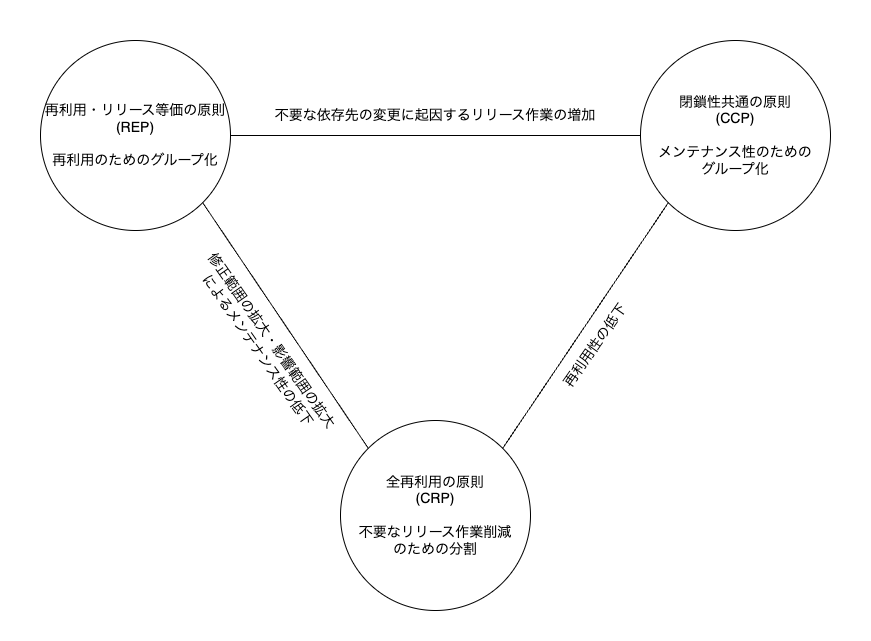
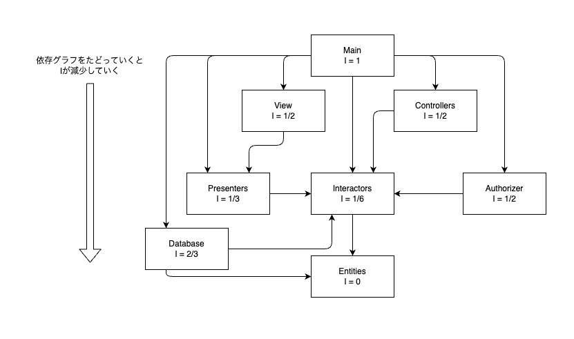
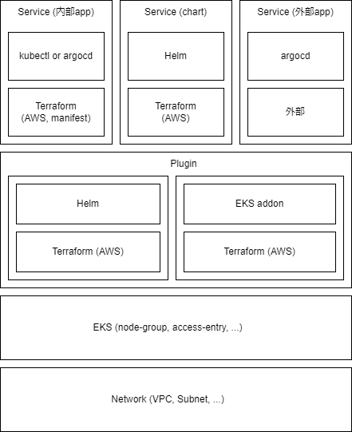
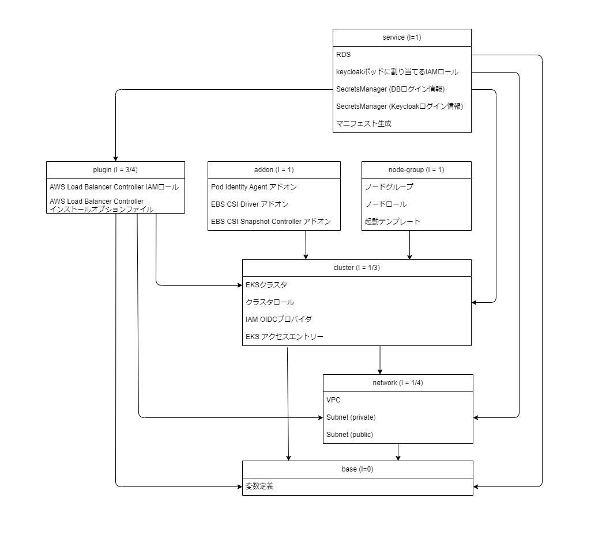

Chapter2 設計・環境構築
---
[READMEに戻る](../README.md)


# ■ 設計

Terraformを実装し始める前に設計について少し考えてみましょう。  

Terraformは最初にデプロイして終わりではありません。サービスが続く限り日々更新・デプロイされます。更新はサービス自体の構成変更の場合もありますし、Terraformやプロバイダのアップデートの場合もあります。  
このように長期間運用されるシステムでは、時間経過とともに発生する様々な変更に耐えられる設計を考える必要があり、この設計の方針によっては、運用の崩壊や障害の増加といったリスクが高まることになります。

# ■ モノリシック VS コンポーネント

基本的にTerraformは1度のデプロイですべてのリソースを作成しきるように組む事がほとんどです。今回はこれをモノリシックな設計と呼ぶことにします。  
しかし、システムの構成によっては、いくつかのリソースをひとまとめにしてコンポーネントを作成し、コンポーネント単位で独立してデプロイできるようにする設計も考えられます。  

モノリシックとコンポーネントどちらを採用すべきでしょうか。

システムの構成にもよりますが **基本的にはモノリシックな設計** を最初に検討するのが良いでしょう。しかしながら、EKSのようにAWSのAPIで設定が完結せず、KubernetesとAWSのリソースが複雑に依存し合っているようなサービスでは、コンポーネントを利用してリソース間の依存を疎結合にする設計が適している場合があります。  
というのも、AWSリソースと外部リソース(KubernetesなどAWS APIで管理不能なリソース)の依存関係が複雑だと、ある変更が全く別のリソースの再作成や削除のトリガーとなってしまうことでサービスの停止やデータの消失といった問題が発生し、解決の難易度も高くなります。  
このようなケースにおいては、いくつかのリソースをコンポーネントにまとめて独立してリリースできるようにすることで、変更の影響範囲を限定させる設計が有効です。

# ■ コンポーネントとは

コンポーネントの分割を行う前にコンポーネントの定義とコンポーネントに含める要素、コンポーネント同士の関係性に関する原則を知っておきましょう。  
ここで説明する原則はプログラムでクラスやモジュールを設計することを想定した原則なので、Terraformだと若干当てはまらない部分があるのですが、考え方として非常に重要なので説明したいと思います。


## コンポーネントの定義

まず、コンポーネントとは **「システムの一部として独立してデプロイ・再利用できる最小限のまとまり」** のことです。  
そして、コンポーネントには一貫したテーマや目的があり、コンポーネントの構成要素はコンポーネントの目的と関連性の高いものでなければなりません。


## コンポーネントの凝集性 (コンポーネントに含める要素について)

コンポーネントに含める要素を決定するには3つの原則があります。

1. **再利用・リリース等価の原則(REP)** (再利用性のためのグループ化)  
再利用可能な単位でひとまとめにすること
2. **閉鎖性共通の原則(CCP)** (保守性のためのグループ化)  
同じ理由、同じタイミングで変更されるものはひとまとめにすること
3. **全再利用の原則(CRP)** (不要なリリース作業を減らすための分割)  
不要なものに依存しないこと

> [!NOTE]
> #### コンポーネントの凝集性とは
>
> コンポーネントが担う責務や機能がどの程度のまとまりを持っているかを示す概念で、具体的には **「コンポーネントの責務が一つに絞り込まれているか」** **「構成要素がコンポーネントの責務と強い関連性を持っているか」** を図る指標となります。  
> 「高い」または「低い」で表します。
> 
>
> - **凝集性が高い**  
>   - 単一の責務に特化している
>   - メンテナンス性・再利用性が高い
>   - コンポーネントの責務を達成するための関連性の強い要素のみで構成されている
> - **凝集性が低い**  
>   - 複数の異なる責務を持っている
>   - 一つの変更に対する修正範囲が大きい
>   - コンポーネントの責務と関連性の薄い構成要素が雑多に詰め込まれている


### 再利用・リリース等価の原則(REP)

> *再利用の単位とリリースの単位は等価になる*

コンポーネントを再利用の単位で作成し、再利用の単位でリリースできるようにすることで、コンポーネントの再利用がしやすくなります。  

> [!CAUTION]
> #### この原則を無視すると...
> 再利用の際に複数のコンポーネントを参照しなければならなくなり、バージョンの互換性の考慮が発生するなど、再利用が難しくなります

### 閉鎖性共通の原則(CCP)

> *同じ理由、同じタイミングで変更されるクラスをコンポーネントにまとめること。変更の理由やタイミングが異なるクラスは別のコンポーネントに分けること。*

コンポーネントが、変更理由や変更タイミングが同じ要素で構成されていれば、一つの変更に対して一つのコンポーネントの変更とデプロイ行うだけで良くなります。  
つまり、変更に対して閉じている(=閉鎖性)ということです。

> [!CAUTION]
> #### この原則を無視すると...
> 同じ理由、同じタイミングで変更されるべきリソースが複数のコンポーネントに散らばっていると、一つの変更で複数のコンポーネントの修正が必要になります。(修正範囲の拡大)  
> 異なる理由、異なるタイミングで変更されるべきリソースが同一コンポーネントにまとまっていると、一つの変更が関係ない機能に影響を及ぼす可能性があります。(影響範囲の拡大)  
> どちらもメンテナンス性が低下します。


### 全再利用の原則(CRP)

<font color="orange">※ この原則はTerraformを前提に考えると理解が難しいのでサラッと流してください。</font>

> *コンポーネントのユーザーに対して、実際には使わないものへの依存を強要してはいけない*

コンポーネントが本当に必要な依存先にのみ依存することで、不要な依存先の変更に起因するリソースを避けることができます。

> [!CAUTION]
> #### この原則を無視すると...
> コンポーネントが不要な依存先に依存することで、不要な依存先の変更の影響ででリリースを強制されるようになります。


### コンポーネントの凝集性のテンション図

これら3つの原則はすべてを遵守すべきものではありません。  
**再利用・リリース等価の原則(REP)** と **閉鎖性共通の原則(CCP)** はコンポーネントを大きくする方向に働き、 **全再利用の原則(CRP)** はコンポーネントを小さくする方向に働くといった点で3つの原則にはトレードオフな部分があり、どの原則を重視するかはプロダクトの状況によってバランスを取りながら変えていく必要があります。  
これら3つの原則のバランスを上手く取るのがアーキテクトの腕の見せ所です。

テンション図は3つの原則がそれぞれどのように影響を及ぼし合うかを示したもので、辺にある記述は反対側の頂点にある原則を無視したときにかかる **コスト** を表しています。


- **再利用・リリース等価の原則 (REP)** と **全再利用の原則 (CRP)** にだけ力を入れていると
  - 些細な修正で多くのコンポーネントの修正が必要になったり、一つの修正が関係のない他の機能に影響を及ぼします。
- **再利用・リリース等価の原則 (REP) ** と ** 閉鎖性共通の原則 (CCP)** にだけ力を入れていると
  - コンポーネントの依存先が増え、不要な依存先の変更に起因した不要なリリースが増加します。
- **全再利用の原則 (CRP)** と **閉鎖性共通の原則 (CCP)** にだけ力を入れていると
  - 再利用の単位が複数のコンポーネントにまたがり再利用しづらくなります。





## コンポーネントの結合 (コンポーネント同士の関係性)

コンポーネント同士の関係性についても3つの原則があります。

1. **非循環依存関係の原則(ADP)**  
コンポーネント同士が循環依存しない
2. **安定依存の原則(SDP)**  
安定度の高いコンポーネントに依存する
3. **安定度・抽象度等価の原則(SAP)**  
安定度が高いコンポーネントほど抽象化されていなければならない

### 非循環依存関係の原則(ADP)
> *コンポーネントの依存グラフに循環依存があってはいけない*

### 安定依存の原則(SDP)
> *安定度の高い方向に依存すること*

> [!NOTE]
> #### 安定度とは
> 安定度(`I`)は `I = 依存している数 / (依存されている数 + 依存している数)` で計算します。  
> 値が小さいほど **安定** 、 値が大きいほど **不安定** となります。  
> - `I = 0` 最も安定
> - `I = 1` 最も不安定
>
> つまり、たくさん依存されているコンポーネントが **安定** で、逆に、他への依存が多いコンポーネントが **不安定** となります。

安定依存の原則(SDP)は、コンポーネントの `I` を依存するコンポーネントの `I` よりも大きくすべきであるという原則となります。  
つまり、コンポーネントの依存グラフを上からたどると `I` の値は **減少** していくべきだということになります。



誤解を恐れずにざっくりいうと、たくさんの依存されているコンポーネントは、なるべく他のコンポーネントに依存しないようにしましょうということです。

### 安定度・抽象度等価の原則(SAP)

<font color="orange">※ この原則はTerraformでは達成できないので、詳しい説明は省きます。</font>

> *コンポーネントの抽象度は、その安定度と同程度でなければいけない*

これは、安定したコンポーネントは抽象度も高くあるべき、不安定なコンポーネントは具象的であるべきという原則です。


# ■ コンポーネント設計

今回のチュートリアルにおけるコンポーネントを設計していきます。

## レイヤーの整理

まずは今回作成するシステムのレイヤーを整理してみましょう。  
まず、最も下層にあるのがネットワークレイヤーで、その上にEKSのレイヤー、EKSのレイヤーの上にはAddonやHelmでインストールするプラグイン(aws-ebs-csi-driver, albc, etc...)があり、さらにその上に個別のサービス(このチュートリアルではkeycloak)があります。  

注目してほしいのは、**上のレイヤーになるほど頻繁に変更される点**で、レイヤーごとににリソースの生存期間が異なります。コンポーネントはこの生存期間を意識して分割していきます。





### コンポーネント作成

**閉鎖性共通の原則 (CCP)** に基づいて、同じタイミング・同じ理由で変更される(生存期間が近い)リソースをまとめてコンポーネントを作成します。


| コンポーネント | 要素 |
| --- | --- |
| base | いろいろなコンポーネントで利用される共通変数など |
| network | VPC, サブネットなど |
| cluster | EKSクラスタ |
| node-group | EKSのノードグループ, 起動テンプレートなど |
| addon | EKSのアドオン |
| plugin | helmでインストールするチャートに付随するリソース |
| service | EKSにデプロイするサービスに付随するリソース |


### コンポーネントの結合

**非循環依存関係の原則(ADP)** と **安定依存の原則(SDP)** に基づいてコンポーネント同士を結合します。  
※ 循環依存しない、安定度の高いコンポーネントに依存するようにします。




# ■ 環境構築

## ツール類のインストール

Terraform, aws-cli, kubectl, k9s, helmなどのパッケージはdevcontainerに含まれています。  
インストール方法は [.devcontainer/Dockerfile](../.devcontainer/Dockerfile)を参照してください。

## ディレクトリ構成

チュートリアルのソースはすべて `tutorial` ディレクトリ配下に配置します。  

```bash
cd $PROJECT_DIR/tutorial
```

ディレクトリ構成

```
tutorial/
  plugin/
    albc/                       # helmでALBCをインストールするための手順やリソースなど
    metrics-server/             # helmでmetrics-serverをインストールするための手順やリソースなど
    secret-store-csi-driver/    # helmでsecret-store-csi-driverをインストールするための手順やリソースなど
  service/
    keycloak/                   # keycloakをEKSにデプロイするためのマニフェストファイルなど
  terraform/
    components/             # コンポーネントを格納するディレクトリ
      base/                   # いろいろなコンポーネントで利用される共通変数など
      network/                # VPC, サブネットなど
      cluster/                # EKSクラスタ
        tfvars/                 # 環境ごとの変数ファイルを格納するディレクトリ
          dev.tfvars              # dev環境の変数ファイル
        main.tf                 # リソースを定義するファイル
        outputs.tf              # 出力値を定義するファイル
        variables.tf            # 入力変数を定義するファイル
      node-group/             # EKSのノードグループ, 起動テンプレートなど
      addon/                  # EKSのアドオン関連
      plugin/                 # helmでインストールするチャートに付随するリソース
      service/                # EKSにデプロイするサービスに付随するリソース
      tfvars/                 # コンポーネントで共通の変数を格納
    modules/                # モジュールを格納するディレクトリ
      addon/                  # addonコンポーネントに関連するモジュール
      cluster/                # clusterコンポーネントに関連するモジュール
        eks/                    # eksモジュール
          main.tf                 # リソースを定義するファイル
          outputs.tf              # 出力値を定義するファイル
          variables.tf            # 入力変数を定義するファイル
      node-group/             # node-groupコンポーネントに関連するモジュール
      plugin/                 # pluginコンポーネントに関連するモジュール
      service/                # serviceコンポーネントに関連するモジュール
```

## .gitignore配置

[Terraform.gitignore - gitignore | Github](https://github.com/github/gitignore/blob/main/Terraform.gitignore)

`terraform/.gitignore`

```ini
# Local .terraform directories
**/.terraform/*

# .tfstate files
*.tfstate
*.tfstate.*

# Crash log files
crash.log
crash.*.log

# Exclude all .tfvars files, which are likely to contain sensitive data, such as
# password, private keys, and other secrets. These should not be part of version 
# control as they are data points which are potentially sensitive and subject 
# to change depending on the environment.
#*.tfvars
*.tfvars.json

# Ignore override files as they are usually used to override resources locally and so
# are not checked in
override.tf
override.tf.json
*_override.tf
*_override.tf.json

# Ignore transient lock info files created by terraform apply
.terraform.tfstate.lock.info

# Include override files you do wish to add to version control using negated pattern
# !example_override.tf

# Include tfplan files to ignore the plan output of command: terraform plan -out=tfplan
# example: *tfplan*

# Ignore CLI configuration files
.terraformrc
terraform.rc
```

## tfstate管理用s3バケット作成

terraformのtfstateを管理するS3バケットを作成します。

```bash
# tfstateファイルをS3で管理する
# https://developer.hashicorp.com/terraform/language/settings/backends/s3
TFSTATE_BUCKET="tfstateの保存先バケット"

aws s3api create-bucket \
  --bucket $TFSTATE_BUCKET \
  --region ap-northeast-1 \
  --create-bucket-configuration LocationConstraint=ap-northeast-1

```

## tfstate保存先を指定するための変数ファイルを作成

※ `EDIT: ...` コメントの項目を各自編集してください

tfstateの保存先バケットはコンポーネント間で共通なので、共通して利用する変数ファイルに定義します。


`terraform/components/tfvars/backend.tfvars`

```ini
region         = "ap-northeast-1"
# tfstateの保存先バケット
bucket         = "tfstateの保存先バケット"  # EDIT: tfstateファイル保存用に作成したS3バケット名を指定
# tfstateのロック
use_lockfile  = true
# tfstateの暗号化
encrypt = true
```

## コンポーネント間で共通して利用するための変数ファイルを作成

※ `EDIT: ...` コメントの項目を各自編集してください

`terraform/components/tfvars/common.tfvars`

```ini
tfstate_region = "ap-northeast-1"
# tfstateの保存先バケット
tfstate_bucket = "tfstateの保存先バケット"  # EDIT: tfstateファイル保存用に作成したS3バケット名を指定
```