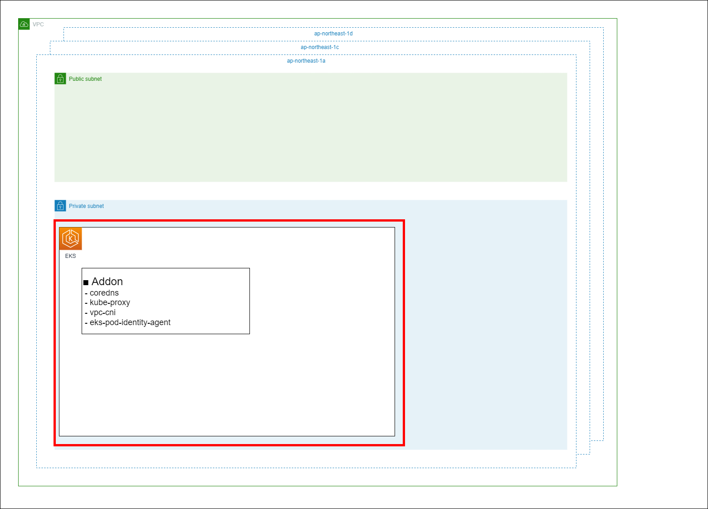

Chapter2 EKSクラスタ作成
---
[READMEに戻る](../README.md)

# ■ 作るもの

この章ではEKSクラスタを作成します。




# ■ EKSクラスタの作成

EKSクラスタは [terraform-aws-modules/eks/aws](https://registry.terraform.io/modules/terraform-aws-modules/eks/aws/latest) という外部モジュールを利用して作成します。


`terraform/envs/dev/cluster/main.tf`

```hcl
/**
 * EKSクラスタ作成
 *
 * terraform-aws-modules/eks/aws | Terraform
 * https://registry.terraform.io/modules/terraform-aws-modules/eks/aws/latest
 */
module "eks" {
  source  = "terraform-aws-modules/eks/aws"
  version = "~> 20.22.0"

  cluster_name = local.cluster_name
  cluster_version = "1.30"

  // コントロールプレーンにインターネット経由でアクセスする
  cluster_endpoint_public_access = true

  vpc_id = module.vpc.vpc_id

  // ノード/ノードグループがプロビジョニングされるサブネットID
  // control_plane_subnet_idsが省略された場合、コントロールプレーンのENIもこのサブネットにプロビジョニングされる
  subnet_ids = module.vpc.private_subnets

  // IAM Roles for Service Accounts (IRSA) を利用するためのEKS用のOIDCプロバイダを作成する
  enable_irsa = true

  // TerraformをデプロイしたRoleにkubernetesAPIへのアクセス権を付与する (これがないとkubectlコマンドで操作できない)
  enable_cluster_creator_admin_permissions = true

  // IAMユーザー・ロールにKubernetesAPIへのアクセス権限を付与する方式 API or API_AND_CONFIG_MAP
  // https://docs.aws.amazon.com/ja_jp/eks/latest/userguide/grant-k8s-access.html#set-cam
  authentication_mode = "API_AND_CONFIG_MAP"
}
```

# ■ IAMユーザー・ロールにKubernetesAPIへのアクセス権限を付与

kubectlを実行するロールやAWSのコンソールからEKSのリソースを確認するユーザーにKubernetesAPIへのアクセス権限を付与します。  
※ aws-auth ConfigMapで設定することもできますが、 `authentication_mode=API_AND_CONFIG_MAP` を設定しているので、今回はアクセスエントリから設定します。

- [IAM アイデンティティと Kubernetes のアクセス許可を関連付ける](https://docs.aws.amazon.com/ja_jp/eks/latest/userguide/grant-k8s-access.html#authentication-modes)


IAMロール, IAMユーザーを受け取るための変数を定義します。

`tutorial/terraform/envs/dev/cluster/variables.tf`

```hcl
// EKSのアクセスエントリに追加するIAMユーザまたはIAMロールのARN
variable access_entries {
  type = list(string)
}

```

このままだと、デプロイ時に毎回変数を手打ちしなければならないので、変数に入力する値をファイルで定義します。  
※ このファイルは機密情報が入るので.gitignoreでgitの管理からはずした方がいいです。

`tutorial/terraform/envs/dev/cluster/secrets.auto.tfvars`

```hcl
access_entries = [
  "arn:aws:iam::111111111111:user/xxxxxxxxxxxxxxxx",
  "arn:aws:iam::111111111111:role/xxxxxxxxxxxxxxxxxxxxxxxxxxx",
]
```


`access_entries` 変数に指定されたIAMユーザー,IAMロールをEKSのアクセスエントリに追加します。

※ `access_entries` は配列なので `for_each` を利用してループしています

`terraform/envs/dev/cluster/main.tf`

```hcl
/**
 * IAMユーザー・ロールにkubernetesAPIへのアクセス権限を付与
 * - EKS アクセスエントリを使用して Kubernetes へのアクセスを IAM ユーザーに許可する | AWS
 *   https://docs.aws.amazon.com/ja_jp/eks/latest/userguide/access-entries.html
 */
// aws_eks_access_entry | Terraform
// https://registry.terraform.io/providers/hashicorp/aws/latest/docs/resources/eks_access_entry
resource "aws_eks_access_entry" "admin" {
  for_each = toset(var.access_entries)  // 配列はループできないのでセットに変換
  cluster_name      = local.cluster_name
  principal_arn     = each.key
  type              = "STANDARD"

  depends_on = [
    module.eks
  ]
}

// aws_eks_access_policy_association | Terraform
// https://registry.terraform.io/providers/hashicorp/aws/latest/docs/resources/eks_access_policy_association
resource "aws_eks_access_policy_association" "admin" {
  for_each = toset(var.access_entries)
  cluster_name  = local.cluster_name
  // アクセスポリシー: https://docs.aws.amazon.com/ja_jp/eks/latest/userguide/access-policies.html#access-policy-permissions
  policy_arn    = "arn:aws:eks::aws:cluster-access-policy/AmazonEKSClusterAdminPolicy"
  principal_arn = each.key

  access_scope {
    type       = "cluster"
  }

  depends_on = [
    module.eks
  ]
}

```


# ■ アドオンのインストール

EKSにインストールするアドオンを定義していきます

`terraform/envs/dev/cluster/main.tf`

```hcl
/**
 * アドオン
 *
 * aws_eks_addon | Terraform
 * https://registry.terraform.io/providers/hashicorp/aws/latest/docs/resources/eks_addon
 */
resource "aws_eks_addon" "coredns" {
  cluster_name  = local.cluster_name
  addon_name    = "coredns"
  addon_version = "v1.11.1-eksbuild.8"

  depends_on = [
    module.node_group_1
  ]
}

resource "aws_eks_addon" "kube_proxy" {
  cluster_name = local.cluster_name
  addon_name   = "kube-proxy"
  addon_version = "v1.30.0-eksbuild.3"
  depends_on = [
    module.node_group_1
  ]
}

resource "aws_eks_addon" "vpc_cni" {
  cluster_name = local.cluster_name
  addon_name   = "vpc-cni"
  addon_version = "v1.18.3-eksbuild.1"
  depends_on = [
    module.node_group_1
  ]
}

resource "aws_eks_addon" "eks_pod_identity_agent" {
  cluster_name = local.cluster_name
  addon_name   = "eks-pod-identity-agent"
  addon_version = "v1.3.0-eksbuild.1"
  depends_on = [
    module.node_group_1
  ]
}
```

# ■ ノードグループの作成

ノードグループは異なる設定で複数作成したい場合があるので、モジュール化してみましょう。

## モジュールの定義


### 変数定義

まずは、ノードグループモジュールが受け取る変数を定義します。  
今回はノードグループ名、インスタンスタイプ、インスタンス数を指定できるようにします。


`terraform/modules/node-group/variables.tf`

```hcl
variable app_name {}
variable stage {}
variable node_group_name {}
variable instance_types {
  type = list(string)
  default = ["m6a.large"]
}
variable desired_size {
  type = number
  default = 1
}

// Data Source: aws_eks_cluster
// https://registry.terraform.io/providers/hashicorp/aws/latest/docs/data-sources/eks_cluster
data "aws_eks_cluster" "this" {
  name = local.cluster_name
}

locals {
  cluster_name = "${var.app_name}-${var.stage}"
}

```

### リソース定義

ノードグループで起動するインスタンスのインスタンスロールを定義します。

`terraform/modules/node-group/main.tf`

```hcl
/**
 * ノードのIAMロールの作成
 *   - managed_node_group で使用する IAM ロールを作成します。
 *     - https://docs.aws.amazon.com/ja_jp/eks/latest/userguide/create-node-role.html#create-worker-node-role
 *   - terraform-aws-eks の サブモジュール eks-managed-node-group のソースコード
 *     - https://github.com/terraform-aws-modules/terraform-aws-eks/blob/v20.14.0/modules/eks-managed-node-group/main.tf#L470
 */
resource "aws_iam_role" "eks_node_role" {
  name = "${var.app_name}-${var.stage}-${var.node_group_name}-EKSNodeRole"
  assume_role_policy = jsonencode({
    "Version": "2012-10-17",
    "Statement": [
      {
        "Effect": "Allow",
        "Principal": {
          "Service": "ec2.amazonaws.com"
        },
        "Action": "sts:AssumeRole"
      }
    ]
  })
}

resource "aws_iam_role_policy_attachment" "eks_worker_node_policy" {
  role = aws_iam_role.eks_node_role.name
  policy_arn = "arn:aws:iam::aws:policy/AmazonEKSWorkerNodePolicy"
}

resource "aws_iam_role_policy_attachment" "ec2_container_registry_read_only" {
  role = aws_iam_role.eks_node_role.name
  policy_arn = "arn:aws:iam::aws:policy/AmazonEC2ContainerRegistryReadOnly"
}

resource "aws_iam_role_policy_attachment" "eks_cni_policy" {
  role = aws_iam_role.eks_node_role.name
  policy_arn = "arn:aws:iam::aws:policy/AmazonEKS_CNI_Policy"
}

resource "aws_iam_policy" "amazoneks_cni_ipv6_policy" {
  name = "${var.app_name}-${var.stage}-${var.node_group_name}-AmazonEKS_CNI_IPv6_Policy"
  policy = jsonencode({
    "Version": "2012-10-17",
    "Statement": [
      {
        "Effect": "Allow",
        "Action": [
          "ec2:AssignIpv6Addresses",
          "ec2:DescribeInstances",
          "ec2:DescribeTags",
          "ec2:DescribeNetworkInterfaces",
          "ec2:DescribeInstanceTypes"
        ],
        "Resource": "*"
      },
      {
        "Effect": "Allow",
        "Action": [
          "ec2:CreateTags"
        ],
        "Resource": [
          "arn:aws:ec2:*:*:network-interface/*"
        ]
      }
    ]
  })
}

resource "aws_iam_role_policy_attachment" "amazoneks_cni_ipv6_policy" {
  role = aws_iam_role.eks_node_role.name
 
  policy_arn = aws_iam_policy.amazoneks_cni_ipv6_policy.arn
}
```

ノードグループのインスタンスが利用する起動テンプレートを定義します。

`terraform/modules/node-group/main.tf`

```hcl
/**
 * 起動テンプレート
 * https://registry.terraform.io/providers/hashicorp/aws/latest/docs/resources/launch_template
 */
resource "aws_launch_template" "node_instance" {
  name = "${var.app_name}-${var.stage}-${var.node_group_name}-EKSNodeLaunchTemplate"

  // イメージ ID を明示的に指定する場合
  // image_id = nonsensitive(aws_ssm_parameter.eks_ami_release_version.value)

  vpc_security_group_ids = [
    data.aws_eks_cluster.this.vpc_config[0].cluster_security_group_id,
  ]

  block_device_mappings {
    device_name = "/dev/xvda"
    ebs {
      volume_size = 50
      volume_type = "gp3"
    }
  }

  monitoring {
    enabled = true
  }

  tag_specifications {
    resource_type = "instance"

    tags = {
      Name = "${var.app_name}-${var.stage}-${var.node_group_name}"
    }
  }
}
```

ノードグループを定義します。  


`terraform/modules/node-group/main.tf`

```hcl
/**
 * EKSノードグループ
 * https://registry.terraform.io/providers/hashicorp/aws/latest/docs/resources/eks_node_group
 */
resource "aws_eks_node_group" "this" {
  cluster_name    = local.cluster_name
  version         = data.aws_eks_cluster.this.version

  node_group_name = var.node_group_name
  node_role_arn   = aws_iam_role.eks_node_role.arn
  subnet_ids      = data.aws_eks_cluster.this.vpc_config[0].subnet_ids
  capacity_type = "SPOT"
  // スポット料金: https://aws.amazon.com/jp/ec2/spot/pricing/
  instance_types = var.instance_types

  scaling_config {
    desired_size = var.desired_size
    max_size     = 10
    min_size     = 1
  }

  // 起動テンプレートを指定する場合、disk_size , remote_access
  launch_template {
    id = aws_launch_template.node_instance.id
    version = aws_launch_template.node_instance.latest_version
  }

  update_config {
    // ノード更新時に利用不可能になるノードの最大数
    max_unavailable = 1
  }


  // ロールは作成済みだけど、ポリシーがアタッチされていない状況が発生するので、depends_on でポリシーのアタッチを待つ
  depends_on = [
    aws_iam_role_policy_attachment.eks_worker_node_policy,
    aws_iam_role_policy_attachment.ec2_container_registry_read_only,
    aws_iam_role_policy_attachment.eks_cni_policy,
    aws_iam_role_policy_attachment.amazoneks_cni_ipv6_policy,
  ]
}
```


## モジュールの利用

先ほど定義したノードグループモジュールを利用してみましょう。  
モジュールを利用する場合はサードパティ製のモジュールを利用するときと同様 `module` 構文を利用します。  
自作のモジュールの場合は `source` パラメータに相対パスでモジュールのディレクトリを指定し、 `variable` として定義した変数を渡します。


`terraform/envs/dev/cluster/main.tf`

```hcl
/**
 * ノードグループ
 */
module node_group_1 {
  source = "../../../modules/node-group"
  app_name = local.app_name
  stage = local.stage
  node_group_name = "ng-1"
  // スポット料金: https://aws.amazon.com/jp/ec2/spot/pricing/
  instance_types = ["t3a.xlarge"]
  desired_size = 1

  depends_on = [
    module.eks
  ]
}

```

# ■ 出力の設定

EKSクラスタのクラスタ名を出力します。

`terraform/envs/dev/cluster/outputs.tf`

```hcl
output cluster_name {
  value = local.cluster_name
}
```


# ■ デプロイ

terraformを実行してVPCを作成してみましょう

```bash
# 初期化
terraform -chdir=terraform/envs/dev/cluster init

# デプロイ内容確認
terraform -chdir=terraform/envs/dev/cluster plan

# デプロイ
terraform -chdir=terraform/envs/dev/cluster apply -auto-approve
```

## 確認

outputs.tfに定義したoutputを出力してみましょう

```bash
# output をすべて出力
terraform -chdir=terraform/envs/dev/cluster output

# 指定したoutputを出力
terraform -chdir=terraform/envs/dev/cluster output cluster_name

# スクリプトで利用しやすい形で出力
terraform -chdir=terraform/envs/dev/cluster output -raw cluster_name
```


k9sでリソースを確認してみましょう

```bash
CLUSTER_NAME=$(terraform -chdir=terraform/envs/dev/cluster output -raw cluster_name)

# ~/.kube/configを生成
aws eks update-kubeconfig --name $CLUSTER_NAME

# CURRENTに今作成したクラスタが選択されているかを確認
kubectl config get-contexts

# k9sを起動してリソースを確認
k9s
```