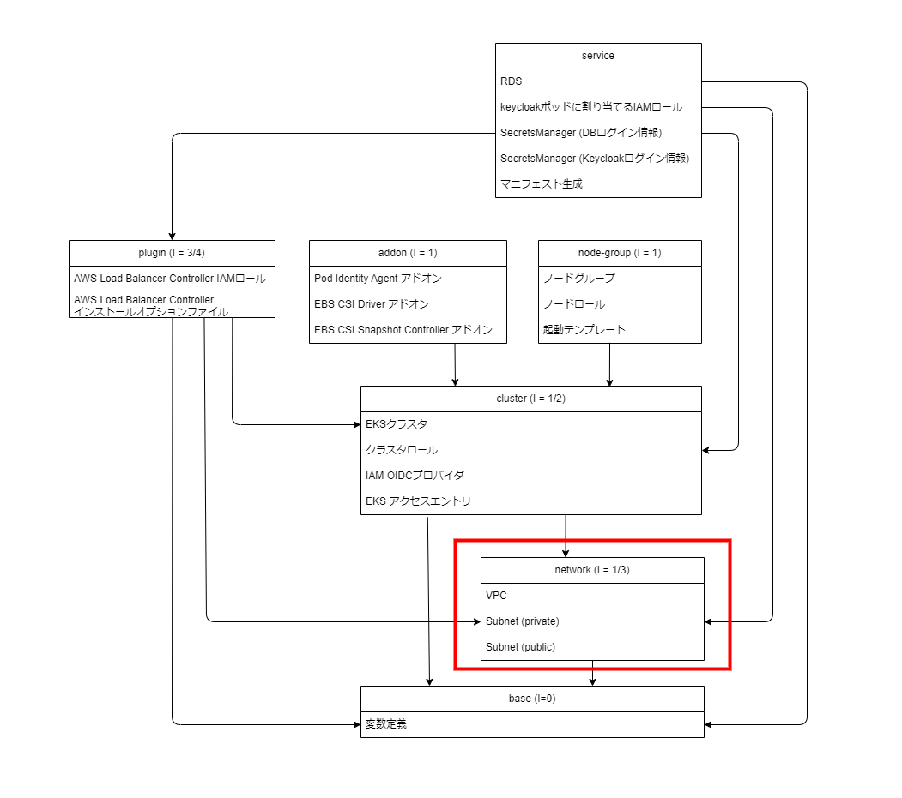

Chapter3 ベース作成
---
[READMEに戻る](../README.md)

# ■ 作るもの

この章では、これ以降に作成するコンポーネントから参照される変数を格納するbaseコンポーネントを作成します。

## コンポーネント




# ■ 変数の定義

`terraform/components/base/variables.tf`

```tf
variable project_name {
  type = string
  description = "プロジェクト名"
}

variable stage {
  type = string
  description = "ステージ名"
}

variable tfstate_region {
  type = string
  description = "tfstateが保存されているリージョン"
}

variable tfstate_bucket {
  type = string
  description = "tfstateが保存されているS3バケット"
}

```

# ■ ベースコンポーネントの作成
## tfstateとプロバイダの設定

- `terraform`
  - `required_version`  
  インストールしてあるTerraformのバージョンを指定します。 ( `terraform --version` )
  - `backend`  
  terraformではリソースを `terraform.tfstate` というファイルで管理しますが、デフォルトだとこのファイルはローカルに生成されてしまうため、s3バケットに保存するように設定します。  
  設定は terraform init 時に変数ファイル(terraform/components/tfvars/backend.tfvars) で指定するので、ソースコード上は空で問題ありません。
  - `required_providers`  
  利用するプロバイダを指定します。今回は [AWSプロバイダ](https://registry.terraform.io/providers/hashicorp/aws/latest/docs) を利用します。
- `provider`  
awsプロバイダの設定を記述します。

`terraform/components/base/main.tf`

```tf
terraform {
  required_version = "~> 1.10"

  // tfstateファイルをs3で管理する: https://developer.hashicorp.com/terraform/language/settings/backends/s3
  backend "s3" {
  }

  required_providers {
    // AWS Provider: https://registry.terraform.io/providers/hashicorp/aws/latest/docs
    aws = {
      source  = "hashicorp/aws"
      version = "~> 5.82.2"
    }
  }
}
```

# ■ 出力値の定義

`terraform/components/base/main.tf`

```tf
output "cluster_name" {
  value = "${var.project_name}-${var.stage}"
}

output "project_dir" {
  value = abspath("${path.module}/../../..")
}
```

# ■ baseコンポーネントの入力変数ファイルの作成

共通変数(`terraform/components/tfvars/common.tfvars`)しか利用しないので、空のままでOK

`terraform/components/base/tfvars/dev.tfvars`


# ■ terraformデプロイ

※ `EDIT: ...` コメントの項目を各自編集してください

terraformを実行してVPCを作成してみましょう

```bash
# プロジェクト名
PROJECT_NAME=プロジェクト名  # EDIT: 任意のプロジェクト名を指定
# ステージ名
STAGE=dev
# tfstateの保存先を定義した変数ファイル
COMMON_BACKEND_CONFIG=$PROJECT_DIR/tutorial/terraform/components/tfvars/backend.tfvars
# コンポーネント間で共通の入力変数ファイル
COMMON_TFVARS=$PROJECT_DIR/tutorial/terraform/components/tfvars/common.tfvars
# コンポーネント名
COMPONENT=base
# コンポーネントディレクトリ
COMPONENT_DIR=$PROJECT_DIR/tutorial/terraform/components/$COMPONENT
# コンポーネントの入力変数ファイル
COMPONENT_TFVARS=$COMPONENT_DIR/tfvars/$STAGE.tfvars


# 初期化
# -chdir terraformコマンドを実行するディレクトリ
# -reconfigure tfstateのバックエンド設定を再構成します
# -backend-config tfstateのバックエンド設定をファイルファイルまたは変数で指定します
terraform -chdir=$COMPONENT_DIR init \
  -reconfigure \
  -backend-config $COMMON_BACKEND_CONFIG \
  -backend-config "key=$PROJECT_NAME/$STAGE/$COMPONENT/terraform.tfstate"

# デプロイ内容の確認
# -chdir terraformコマンドを実行するディレクトリ
# -var-file terraformの入力変数をファイルで指定します
terraform -chdir=$COMPONENT_DIR plan \
  -var "project_name=$PROJECT_NAME" \
  -var "stage=$STAGE" \
  -var-file $COMMON_TFVARS \
  -var-file $COMPONENT_TFVARS

# デプロイ
# -chdir terraformコマンドを実行するディレクトリ
# -var-file terraformの入力変数をファイルで指定します
# -auto-approve terraformデプロイ時の確認プロンプトをスキップします
terraform -chdir=$COMPONENT_DIR apply \
  -var "project_name=$PROJECT_NAME" \
  -var "stage=$STAGE" \
  -var-file $COMMON_TFVARS \
  -var-file $COMPONENT_TFVARS \
  -auto-approve
```

# ■ Makefileの作成

terraformのコマンドはオプションが多く、毎回オプションを指定して実行するとどこかで必ずミスが発生するので、Makefileでデプロイできるようにします。

`Makefile`

```Makefile
SCRIPT_DIR := $(shell cd $(dir $(abspath $(lastword $(MAKEFILE_LIST)))) && pwd)
PROJECT_NAME ?=
STAGE ?=
COMPONENT ?=
COMMON_BACKEND_CONFIG := $(SCRIPT_DIR)/terraform/components/tfvars/backend.tfvars
COMMON_TFVARS := $(SCRIPT_DIR)/terraform/components/tfvars/common.tfvars
COMPONENT_DIR := $(SCRIPT_DIR)/terraform/components/$(COMPONENT)
COMPONENT_TFVARS=$(COMPONENT_DIR)/tfvars/$(STAGE).tfvars
TFPLAN_DIR := $(SCRIPT_DIR)/.tfplan/$(COMPONENT)/

.PHONY: option-parser
option-parser:
	@if [ -z "$(PROJECT_NAME)" ]; then \
	  echo "[Err] PROJECT_NAME is required"; \
	  exit 1; \
	fi
	@if [ -z "$(STAGE)" ]; then \
	  echo "[Err] STAGE is required"; \
	  exit 1; \
	fi
	@if [ -z "$(COMPONENT)" ]; then \
	  echo "[Err] COMPONENT is required"; \
	  exit 1; \
	fi

.PHONY: tf-validate 
tf-validate: tf-init  ## terraform validate
	terraform -chdir=$(COMPONENT_DIR) validate

.PHONY: tf-init
tf-init: option-parser ## terraform init
	terraform -chdir=$(COMPONENT_DIR) init \
	  -upgrade \
	  -reconfigure \
	  -backend-config $(COMMON_BACKEND_CONFIG) \
	  -backend-config "key=$(PROJECT_NAME)/$(STAGE)/$(COMPONENT)/terraform.tfstate"

.PHONY: tf-plan
tf-plan: tf-validate ## terraform plan
	mkdir -p $(TFPLAN_DIR)
	terraform -chdir=$(COMPONENT_DIR) plan \
	  -var "project_name=$(PROJECT_NAME)" \
	  -var "stage=$(STAGE)" \
	  -var-file=$(COMMON_TFVARS) \
	  -var-file=$(COMPONENT_TFVARS) \
	  -out $(TFPLAN_DIR)/.plan
	terraform -chdir=$(COMPONENT_DIR) show -json $(TFPLAN_DIR)/.plan > $(TFPLAN_DIR)/plan.tfgraph

.PHONY: tf-apply
tf-apply: tf-validate ## terraform apply
	terraform -chdir=$(COMPONENT_DIR) apply \
	  -var "project_name=$(PROJECT_NAME)" \
	  -var "stage=$(STAGE)" \
	  -var-file=$(COMMON_TFVARS) \
	  -var-file $(COMPONENT_TFVARS) \
	  --auto-approve

.PHONY: tf-output
tf-output: tf-validate ## terraform apply
	terraform -chdir=$(COMPONENT_DIR) output

.PHONY: tf-destroy
tf-destroy: tf-validate ## terraform destroy
	terraform -chdir=$(COMPONENT_DIR) destroy \
	  -var "project_name=$(PROJECT_NAME)" \
	  -var "stage=$(STAGE)" \
	  -var-file=$(COMMON_TFVARS) \
	  -var-file $(COMPONENT_TFVARS) \
	  --auto-approve

.PHONY: help
.DEFAULT_GOAL := help
help: ## HELP表示
	@grep --no-filename -E '^[a-zA-Z0-9_-]+:.*?## .*$$' $(MAKEFILE_LIST) | sort | awk 'BEGIN {FS = ":.*?## "}; {printf "\033[36m%-20s\033[0m %s\n", $$1, $$2}'
```

Makefileでデプロイを実行してみましょう


```bash
# ヘルプ
make help

# terraformのバリデーション
make tf-validate PROJECT_NAME=$PROJECT_NAME STAGE=$STAGE COMPONENT=$COMPONENT

# terraform plan: 作成されるリソース、現在との差分の確認
# 実行後に .tfplan/base/plan.tfgraph ファイルが生成されるのでVSCodeで開いてみましょう。作成されるリソースの詳細を確認することができます。
make tf-plan PROJECT_NAME=$PROJECT_NAME STAGE=$STAGE COMPONENT=$COMPONENT

# terraform apply: デプロイ
make tf-apply PROJECT_NAME=$PROJECT_NAME STAGE=$STAGE COMPONENT=$COMPONENT

# terraform output: 出力値の確認
make tf-output PROJECT_NAME=$PROJECT_NAME STAGE=$STAGE COMPONENT=$COMPONENT
```