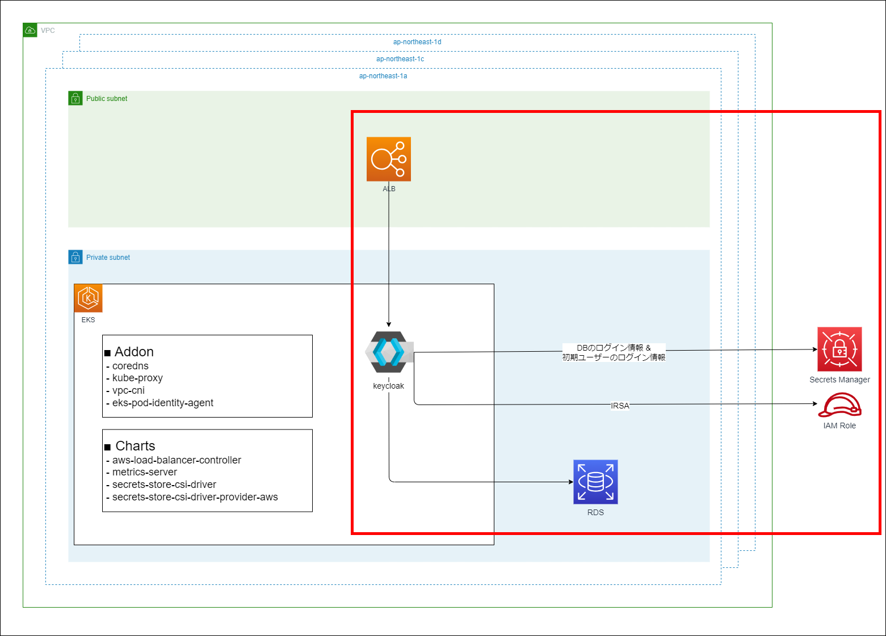

Chapter4 Keycloakの構築
---
[READMEに戻る](../README.md)

# ■ 作るもの

この章ではEKSクラスタ上にkeycloakをデプロイします。  



# ■ 変数の設定

`terraform/envs/dev/keycloak/variables.tf`

```hcl
locals {
  app_name = "xxxxx"  # EDIT: clusterのlocal.app_nameで指定した値を指定してください
  stage    = "dev"
  cluster_name = "${local.app_name}-${local.stage}"
  account_id = data.aws_caller_identity.this.account_id
  aws_region = data.aws_region.this.name
  namespace = "keycloak"
  service_account = "keycloak"
  db_user = "admin"
  db_name = "keycloak"
  oidc_provider = replace(
    // AWS CLIで確認する場合: aws eks describe-cluster --name クラスタ名 --output text --query "cluster.identity.oidc.issuer"
    data.aws_eks_cluster.this.identity[0].oidc[0].issuer,
    "https://",
    ""
  )
}

data "aws_caller_identity" "this" {}

data "aws_region" "this" {}

// aws_eks_cluster: https://registry.terraform.io/providers/hashicorp/aws/latest/docs/data-sources/eks_cluster
data "aws_eks_cluster" "this" {
  name = local.cluster_name
}

// aws_eks_cluster_auth: https://registry.terraform.io/providers/hashicorp/aws/latest/docs/data-sources/eks_cluster_auth
data "aws_eks_cluster_auth" "this" {
  name = local.cluster_name
}
```

# ■ プロバイダの設定

この章では[AWSプロバイダ](https://registry.terraform.io/providers/hashicorp/aws/latest/docs)と[Kubernetesプロバイダ](https://registry.terraform.io/providers/hashicorp/kubernetes/latest/docs)を利用します。

`terraform/envs/dev/keycloak/main.tf`
```hcl
terraform {
  required_version = "~> 1.9.4"

  backend "s3" {
    bucket = "terraform-tutorial-eks-tfstate"
    key    = "xxxxxx/dev/chart/terraform.tfstate"  // EDIT: clusterで指定した値を指定してください
    region = "ap-northeast-1"
    encrypt = true
    dynamodb_table = "terraform-tutorial-eks-tfstate-lock"
  }

  required_providers {
    // AWS Provider: https://registry.terraform.io/providers/hashicorp/aws/latest/docs
    aws = {
      source  = "hashicorp/aws"
      version = "~> 5.61.0"
    }
    // Kubernetes Provider: https://registry.terraform.io/providers/hashicorp/kubernetes/latest/docs
    kubernetes = {
      source  = "hashicorp/kubernetes"
      version = "~> 2.31.0"
    }
  }
}

// AWS Provider: https://registry.terraform.io/providers/hashicorp/aws/latest/docs
provider "aws" {
  region = "ap-northeast-1"
  default_tags {
    tags = {
      PROJECT = "TERRAFORM_TUTORIAL_EKS",
    }
  }
}

// Kubernetes Provider: https://registry.terraform.io/providers/hashicorp/kubernetes/latest/docs
provider "kubernetes" {
  // kubenetesAPIのホスト名(URL形式)。KUBE_HOST環境変数で指定している値に基づく。
  host                   = data.aws_eks_cluster.this.endpoint
  // TLS認証用のPEMエンコードされたルート証明書のバンドル
  cluster_ca_certificate = base64decode(data.aws_eks_cluster.this.certificate_authority[0].data)
  token                  = data.aws_eks_cluster_auth.this.token
}
```

# ■ ネームスペースの作成

`keycloak` 関連のリソースを作成するためのネームスペースを作成します。


`terraform/envs/dev/keycloak/main.tf`
```hcl
/**
 * namespaceの作成
 */
// https://registry.terraform.io/providers/hashicorp/kubernetes/latest/docs/resources/namespace
resource "kubernetes_namespace" "keycloak" {
  metadata {
    name = local.namespace
  }
}

```

# ■ サービスアカウントとIAMロールの作成

`keycloak` のポッドを動かすサービスアカウントとサービスアカウントに紐づけるIAMロールを作成します。  
ポリシーには、SecretsManagerからDBのログイン情報と初期ユーザー情報を取得するための `secretsmanager:GetSecretValue` `secretsmanager:DescribeSecret` 権限を付与します。


`terraform/envs/dev/keycloak/main.tf`
```hcl
/**
 * サービスアカウントとIAMロールの作成
 */
// IRSA(IAM Roles for Service Accounts)用のサービスアカウントを作成します。
// https://registry.terraform.io/providers/hashicorp/kubernetes/latest/docs/resources/service_account
resource "kubernetes_service_account" "keycloak" {
  metadata {
    name      = local.service_account
    namespace = local.namespace
    annotations = {
      "eks.amazonaws.com/role-arn" = aws_iam_role.keycloak.arn
    }
  }
}

resource "aws_iam_role" "keycloak" {
  name = "${local.app_name}-${local.stage}-KeycloakRole"
  assume_role_policy = jsonencode({
    "Version": "2012-10-17"
    "Statement": {
      "Effect": "Allow",
      "Principal": {
        "Federated": "arn:aws:iam::${local.account_id}:oidc-provider/${local.oidc_provider}"
      },
      "Action": "sts:AssumeRoleWithWebIdentity",
      "Condition": {
        "StringLike": {
          "${local.oidc_provider}:sub": "system:serviceaccount:${local.namespace}:${local.service_account}",
          "${local.oidc_provider}:aud": "sts.amazonaws.com"
        }
      }
    }
  })
}

resource "aws_iam_policy" "keycloak" {
  name = "${local.app_name}-${local.stage}-KeycloakPolicy"
  policy = jsonencode({
    "Version": "2012-10-17",
    "Statement": [
      {
        "Effect": "Allow",
        "Action": [
          "secretsmanager:GetSecretValue",
          "secretsmanager:DescribeSecret"
        ],
        "Resource": [
          "arn:aws:secretsmanager:${local.aws_region}:${local.account_id}:secret:/${local.app_name}/${local.stage}/*"
        ]
      }
    ]
  })
}

resource "aws_iam_role_policy_attachment" "keycloak" {
  role = aws_iam_role.keycloak.name
  policy_arn = aws_iam_policy.keycloak.arn
}
```

# ■ keycloakの初期ユーザーのログイン情報を保持するSecretsManagerを作成

terraform組み込みの[randomプロバイダ](https://registry.terraform.io/providers/hashicorp/random/latest)の [random_passwordリソース](https://registry.terraform.io/providers/hashicorp/random/latest/docs/resources/password)を利用して、ログインIDとパスワードを生成し、SecretsManage登録します。


`terraform/envs/dev/keycloak/main.tf`
```hcl
/**
 * Keycloakのadminログイン情報を保持する SecretsManager
 */
// https://registry.terraform.io/providers/hashicorp/random/latest/docs/resources/password
resource "random_password" "keycloak_user" {
  length           = 32
  lower            = true  # 小文字を文字列に含める
  numeric          = true  # 数値を文字列に含める
  upper            = true  # 大文字を文字列に含める
  special          = false # 記号を文字列に含める
}

resource "random_password" "keycloak_password" {
  length           = 32
  lower            = true  # 小文字を文字列に含める
  numeric          = true  # 数値を文字列に含める
  upper            = true  # 大文字を文字列に含める
  special          = true  # 記号を文字列に含める
  override_special = "@_=+-"  # 記号で利用する文字列を指定 (default: !@#$%&*()-_=+[]{}<>:?)
}

// https://registry.terraform.io/providers/hashicorp/aws/latest/docs/resources/secretsmanager_secret
resource "aws_secretsmanager_secret" "keycloak_admin_user" {
  name = "/${local.app_name}/${local.stage}/keycloak"
  recovery_window_in_days = 0
  force_overwrite_replica_secret = true
}

// https://registry.terraform.io/providers/hashicorp/aws/latest/docs/resources/secretsmanager_secret_version
resource "aws_secretsmanager_secret_version" "keycloak_admin_user" {
  secret_id = aws_secretsmanager_secret.keycloak_admin_user.id
  secret_string = jsonencode({
    user = random_password.keycloak_user.result
    password = random_password.keycloak_password.result
  })
}
```

# ■ RDSとその接続情報を保持するSecretsManagerを作成


`terraform/envs/dev/keycloak/main.tf`
```hcl
/**
 * RDS
 */
// https://registry.terraform.io/providers/hashicorp/aws/latest/docs/resources/security_group
resource "aws_security_group" "app_db_sg" {
  name = "${local.app_name}-${local.stage}-keycloak-db"
  vpc_id = data.aws_eks_cluster.this.vpc_config[0].vpc_id
  egress {
    from_port   = 0
    to_port     = 0
    protocol    = "-1"
    security_groups = [data.aws_eks_cluster.this.vpc_config[0].cluster_security_group_id]
  }
  ingress {
    from_port = 3306
    to_port = 3306
    protocol = "tcp"
    security_groups = [data.aws_eks_cluster.this.vpc_config[0].cluster_security_group_id]
  }
  tags = {
    "Name" = "${local.app_name}-${local.stage}-keycloak-db"
  }
}

// https://registry.terraform.io/providers/hashicorp/aws/latest/docs/resources/db_parameter_group
// MySQLのパラメータの確認: aws rds describe-engine-default-parameters --db-parameter-group-family mysql8.0
resource "aws_db_parameter_group" "app_db_pg" {
  name = "${local.app_name}-${local.stage}-keycloak-db"
  family = "mysql8.0"
  parameter {
    name = "character_set_client"
    value = "utf8mb4"
  }
  parameter {
    name = "character_set_connection"
    value = "utf8mb4"
  }
  parameter {
    name = "character_set_database"
    value = "utf8mb4"
  }
  parameter {
    name = "character_set_filesystem"
    value = "utf8mb4"
  }
  parameter {
    name = "character_set_results"
    value = "utf8mb4"
  }
  parameter {
    name = "character_set_server"
    value = "utf8mb4"
  }
  parameter {
    name = "collation_connection"
    value = "utf8mb4_bin"
  }
  parameter {
    name = "collation_server"
    value = "utf8mb4_bin"
  }
}

// https://registry.terraform.io/providers/hashicorp/aws/latest/docs/resources/db_subnet_group
resource "aws_db_subnet_group" "app_db_subnet_group" {
  name       = "${local.app_name}-${local.stage}-keycloak-db"
  subnet_ids = data.aws_eks_cluster.this.vpc_config[0].subnet_ids
}

resource "random_password" "db_password" {
  length           = 16
  lower            = true  # 小文字を文字列に含める
  numeric          = true  # 数値を文字列に含める
  upper            = true  # 大文字を文字列に含める
  special          = true  # 記号を文字列に含める
  override_special = "@_=+-"  # 記号で利用する文字列を指定 (default: !@#$%&*()-_=+[]{}<>:?)
}

// https://registry.terraform.io/providers/hashicorp/aws/latest/docs/resources/db_instance
resource "aws_db_instance" "app_db" {
  identifier = "${local.app_name}-${local.stage}-keycloak-db"
  storage_encrypted = true
  engine               = "mysql"
  allocated_storage    = 20
  max_allocated_storage = 100
  db_name              = local.db_name
  engine_version       = "8.0"
  instance_class       = "db.t3.micro"
  db_subnet_group_name = aws_db_subnet_group.app_db_subnet_group.name
  backup_retention_period = 30
  enabled_cloudwatch_logs_exports = ["error", "general", "slowquery"]
  multi_az = false
  parameter_group_name = aws_db_parameter_group.app_db_pg.name
  port = 3306
  vpc_security_group_ids = [aws_security_group.app_db_sg.id]
  storage_type = "gp3"
  network_type = "IPV4"
  username = local.db_user
  password = random_password.db_password.result
  skip_final_snapshot  = true
  deletion_protection = false
  lifecycle {
    // terraformから削除されたくない場合はコメントイン
    #prevent_destroy = true
  }
}


/**
 * RDS のログイン情報を保持する SecretsManager
 */
resource "aws_secretsmanager_secret" "app_db_secret" {
  name = "/${local.app_name}/${local.stage}/db"
  recovery_window_in_days = 0
  force_overwrite_replica_secret = true
}

resource "aws_secretsmanager_secret_version" "app_db_secret_version" {
  secret_id = aws_secretsmanager_secret.app_db_secret.id
  secret_string = jsonencode({
    db_user = local.db_user
    db_password = random_password.db_password.result
    db_host = aws_db_instance.app_db.address
    db_port = tostring(aws_db_instance.app_db.port)
    db_name = local.db_name
  })
}
```

# ■ outputの定義

kubernetesのマニフェストから参照するための出力を定義します。


`terraform/envs/dev/keycloak/output.tf`
```hcl
output "namespace" {
  value = local.namespace
}

output "service_account" {
  value = local.service_account
}

output "keycloak_user_secret" {
  value = aws_secretsmanager_secret.keycloak_admin_user.name
}

output "keycloak_db_secret" {
  value = aws_secretsmanager_secret.app_db_secret.name
}
```


# ■ デプロイ

```bash
# 初期化
terraform -chdir=terraform/envs/dev/keycloak init

# デプロイ内容確認
terraform -chdir=terraform/envs/dev/keycloak plan

# デプロイ
terraform -chdir=terraform/envs/dev/keycloak apply -auto-approve
```

## 確認

awsのコンソールから以下を確認します。

- SecretsManagerに `/xxxxx/dev/keycloak` と `/xxxxx/dev/db` が存在する
- RDSに `xxxxx-dev-keycloak-db` インスタンスが存在する

# ■ EKSにkeycloakをデプロイ

## マニフェストファイルを生成するスクリプトの作成

`scripts/keycloak/setup.sh`

```bash
#!/bin/bash

set -eu

SCRIPT_DIR=$(cd $(dirname $0); pwd)
PROJECT_DIR=$(cd $SCRIPT_DIR/../..; pwd)

cd $SCRIPT_DIR


# terraformのoutputから必要な情報を取得
SECURITY_GROUP_NAME=$(terraform -chdir=$PROJECT_DIR/terraform/envs/dev/charts output -raw alb_ingress_sg)
NAMESPACE=$(terraform -chdir=$PROJECT_DIR/terraform/envs/dev/keycloak output -raw namespace)
SERVICE_ACCOUNT=$(terraform -chdir=$PROJECT_DIR/terraform/envs/dev/keycloak output -raw service_account)
USER_SECRET_NAME=$(terraform -chdir=$PROJECT_DIR/terraform/envs/dev/keycloak output -raw keycloak_user_secret)
DB_SECRET_NAME=$(terraform -chdir=$PROJECT_DIR/terraform/envs/dev/keycloak output -raw keycloak_db_secret)

mkdir -p ${SCRIPT_DIR}/tmp

cat <<EOF > ${SCRIPT_DIR}/tmp/app.yaml
---
#
# Keycloakのデータベース接続情報をSecrets Managerから取得する
#
apiVersion: secrets-store.csi.x-k8s.io/v1
kind: SecretProviderClass
metadata:
  name: keycloak-db-spc
  namespace: ${NAMESPACE}
spec:
  provider: aws
  secretObjects:
    - secretName: keycloak-db-secret
      type: Opaque
      data:
        - key: kc_db_host
          objectName: alias_db_host
        - key: kc_db_port
          objectName: alias_db_port
        - key: kc_db_user
          objectName: alias_db_user
        - key: kc_db_password
          objectName: alias_db_password
        - key: kc_db_name
          objectName: alias_db_name
  parameters:
    # jmesPathを利用する場合JSONの値はString型である必要がある
    objects: |
        - objectName: "${DB_SECRET_NAME}"
          objectType: "secretsmanager"
          jmesPath:
            - path: db_host
              objectAlias: alias_db_host
            - path: db_port
              objectAlias: alias_db_port
            - path: db_user
              objectAlias: alias_db_user
            - path: db_password
              objectAlias: alias_db_password
            - path: db_name
              objectAlias: alias_db_name
---
#
# Keycloakの管理ユーザログイン情報をSecrets Managerから取得する
#
apiVersion: secrets-store.csi.x-k8s.io/v1
kind: SecretProviderClass
metadata:
  name: keycloak-user-spc
  namespace: ${NAMESPACE}
spec:
  provider: aws
  secretObjects:
    - secretName: keycloak-user-secret
      type: Opaque
      data:
        - key: keycloak_admin
          objectName: alias_user
        - key: keycloak_admin_password
          objectName: alias_password
  parameters:
    objects: |
        - objectName: "${USER_SECRET_NAME}"
          objectType: "secretsmanager"
          jmesPath:
            - path: user
              objectAlias: alias_user
            - path: password
              objectAlias: alias_password
---
apiVersion: apps/v1
kind: Deployment
metadata:
  name: keycloak
  namespace: ${NAMESPACE}
  labels:
    app: keycloak
spec:
  replicas: 1
  selector:
    matchLabels:
      app: keycloak
  template:
    metadata:
      labels:
        app: keycloak
    spec:
      serviceAccountName: ${SERVICE_ACCOUNT}

      volumes:
        - name: keycloak-user-secret-volume
          csi:
            driver: secrets-store.csi.k8s.io
            readOnly: true
            volumeAttributes:
              secretProviderClass: keycloak-user-spc
        - name: keycloak-db-secret-volume
          csi:
            driver: secrets-store.csi.k8s.io
            readOnly: true
            volumeAttributes:
              secretProviderClass: keycloak-db-spc
      containers:
        - name: keycloak
          image: quay.io/keycloak/keycloak:25.0.1
          args: ["start"]
          env:
            # All Configuration | Keycloak: https://www.keycloak.org/server/all-config
            - name: KC_PROXY_HEADERS  # リバースプロキシを利用する場合の設定: https://www.keycloak.org/server/reverseproxy
              value: "xforwarded"
            - name: KEYCLOAK_ADMIN
              valueFrom:
                secretKeyRef:
                  name: keycloak-user-secret
                  key: keycloak_admin
            - name: KEYCLOAK_ADMIN_PASSWORD
              valueFrom:
                secretKeyRef:
                  name: keycloak-user-secret
                  key: keycloak_admin_password
            - name: KC_DB
              value: "mysql"
            - name: KC_DB_URL_DATABASE
              valueFrom:
                secretKeyRef:
                  name: keycloak-db-secret
                  key: kc_db_name
            - name: KC_DB_URL_HOST
              valueFrom:
                secretKeyRef:
                  name: keycloak-db-secret
                  key: kc_db_host
            - name: KC_DB_URL_PORT
              valueFrom:
                secretKeyRef:
                  name: keycloak-db-secret
                  key: kc_db_port
            - name: KC_DB_USERNAME
              valueFrom:
                secretKeyRef:
                  name: keycloak-db-secret
                  key: kc_db_user
            - name: KC_DB_PASSWORD
              valueFrom:
                secretKeyRef:
                  name: keycloak-db-secret
                  key: kc_db_password
            - name: KC_HOSTNAME_STRICT
              value: "false"
            - name: KC_HTTP_ENABLED  # プロダクションモードではHTTPが無効になるので、明示的にHTTPを有効にする
              value: "true"
          ports:
            - name: http
              containerPort: 8080
          readinessProbe:
            httpGet:
              path: /realms/master
              port: 8080
          volumeMounts:
            - name: keycloak-user-secret-volume
              mountPath: /mnt/keycloak-user-secret-store
              readOnly: true
            - name: keycloak-db-secret-volume
              mountPath: /mnt/keycloak-db-secret-store
              readOnly: true
---
apiVersion: v1
kind: Service
metadata:
  name: keycloak-svc
  namespace: ${NAMESPACE}
  labels:
    app: keycloak
spec:
  ports:
    - name: http
      port: 8080
      targetPort: 8080
  selector:
    app: keycloak
---
apiVersion: networking.k8s.io/v1
kind: Ingress
metadata:
  name: keycloak-alb
  namespace: ${NAMESPACE}
  # Ingress annotations - AWS Load Balancer Controller
  # https://kubernetes-sigs.github.io/aws-load-balancer-controller/v2.4/guide/ingress/annotations/
  annotations:
    alb.ingress.kubernetes.io/scheme: internet-facing
    alb.ingress.kubernetes.io/target-type: ip
    alb.ingress.kubernetes.io/tags: "PROJECT=TERRAFORM_TUTORIAL_EKS"
    alb.ingress.kubernetes.io/listen-ports: '[{"HTTP":80}]'
    alb.ingress.kubernetes.io/security-groups: ${SECURITY_GROUP_NAME}
    alb.ingress.kubernetes.io/manage-backend-security-group-rules: "true"
    alb.ingress.kubernetes.io/healthcheck-path: /realms/master
spec:
  ingressClassName: alb
  rules:
    - http:
        paths:
          - path: /
            pathType: Prefix
            backend:
              service:
                name: keycloak-svc
                port:
                  number: 8080
EOF
```

スクリプトを実行してマニフェストファイルを生成します。

```bash
chmod 755 scripts/keycloak/setup.sh

# マニフェストファイルを生成
scripts/keycloak/setup.sh
```

生成されたマニフェストファイルを確認します。

`scripts/keycloak/tmp/app.yaml`

## マニフェストのデプロイ

```bash
kubectl apply -f scripts/keycloak/tmp/app.yaml
```

keycloakはデフォルトでhttpでログインできないので、ログインできるように設定する

```bash
# k9sでkeycloak コンテナのshellを起動
# keycloakネームスペースの keycloak-xxxxxxxxxx-xxxxx ポッド
k9s
```

keycloakコンテナのshell内での操作

```bash
# SecretsManager (/<app_name>/<ステージ>/keycloak) のユーザー名とパスワードでログイン
$ /opt/keycloak/bin/kcadm.sh config credentials \
    --server http://localhost:8080 \
    --realm master \
    --user $KEYCLOAK_ADMIN \
    --password $KEYCLOAK_ADMIN_PASSWORD

# sslRequiredを無効化
$ /opt/keycloak/bin/kcadm.sh update realms/master -s sslRequired=NONE
```

ALBのエンドポイントにアクセスしてログインできることを確認します。

```bash
kubectl -n keycloak get ing
```
