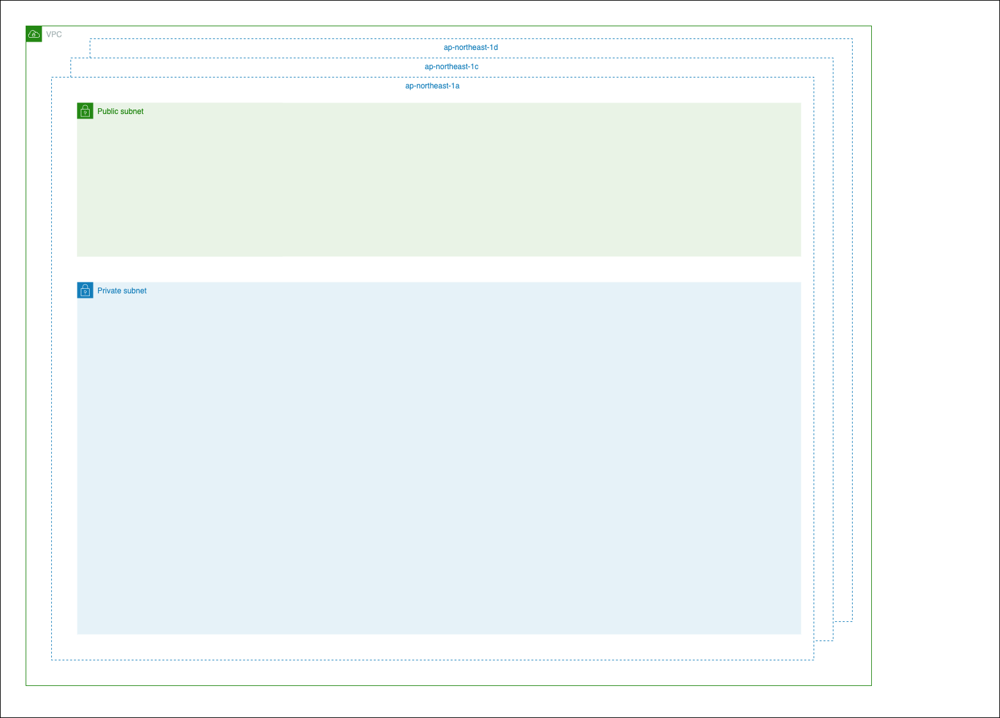

Chapter4 クラスタ作成
---
[READMEに戻る](../README.md)

# ■ 作るもの

この章ではEKSクラスタを作成します。

## 構成図



## コンポーネント


# ■ clusterモジュールの定義

EKSクラスタとその関連リソースをモジュールとして、ひとまとめで定義します。

## モジュールの変数定義

モジュールを呼び出す際に指定する入力値の定義を行います

- `cluster_name` クラスタ名
- `subnet_ids` EKSクラスタがノードを立ち上げるサブネット
- `access_entries` KubernetesのAPIにアクセスできるIAMユーザーもしくはIAMロールのARN

`terraform/modules/cluster/eks/variables.tf`

```tf
variable cluster_name {
  type = string
  description = "EKSクラスタ名"
}
variable subnet_ids {
  type = list(string)
  description = "EKSクラスタを作成するサブネットID"
}
variable access_entries {
  type = list(string)
  description = "EKSのIAMアクセスエントリに登録するIAMユーザまたはIAMロールのARN"
}

data "aws_caller_identity" "self" { }

locals {
  account_id = data.aws_caller_identity.self.account_id
}
```

## モジュールのリソース

### ロググループ

コントロールプレーンログを保持するロググループを定義します。  
ロググループ名は `/aws/eks/クラスタ名/cluster` で固定で、あらかじめ作っておかないと自動作成されてしまうので明示的に定義しておきます。

参考: [コントロールプレーンログを CloudWatch Logs に送信する | AWS](https://docs.aws.amazon.com/ja_jp/eks/latest/userguide/control-plane-logs.html)

`terraform/modules/cluster/eks/main.tf`

```tf
 /**
  * コントロールプレーンのログを保存するロググループ
  *
  * ロググループ名は /aws/eks/{MY_CLUSTER}/cluster で固定
  * 参考: https://docs.aws.amazon.com/ja_jp/eks/latest/userguide/control-plane-logs.html
  *
  */
resource "aws_cloudwatch_log_group" "eks_control_plane" {
  // https://registry.terraform.io/providers/hashicorp/aws/latest/docs/resources/cloudwatch_log_group

  name = "/aws/eks/${var.cluster_name}/cluster"

  // ログの保持期間
  retention_in_days = 30

  tags = {
    Name = "/aws/eks/${var.cluster_name}/cluster"
  }
}
```

### クラスタロール

EKSのコントロールプレーンがAWS APIを呼び出すためのIAMロール。ノード管理などで利用されます。

参考: [Amazon EKS クラスター の IAM ロール | AWS](https://docs.aws.amazon.com/ja_jp/eks/latest/userguide/cluster-iam-role.html)

`terraform/modules/cluster/eks/main.tf`

```tf
/**
 * クラスターロール
 */
resource "aws_iam_role" "cluster_role" {
  name = "${var.cluster_name}-EKSClusterRole"
  assume_role_policy = jsonencode({
    Version   = "2012-10-17"
    Statement = [
      {
        Sid       = "EKSClusterAssumeRole"
        Action    = [ "sts:TagSession", "sts:AssumeRole" ]
        Effect    = "Allow"
        Principal = { Service = "eks.amazonaws.com" }
      }
    ]
  })
}

// aws管理ポリシー
resource "aws_iam_role_policy_attachment" "aws_managed_policy" {
  for_each = toset([
    "arn:aws:iam::aws:policy/AmazonEKSBlockStoragePolicy",
    "arn:aws:iam::aws:policy/AmazonEKSClusterPolicy",
    "arn:aws:iam::aws:policy/AmazonEKSComputePolicy",
    "arn:aws:iam::aws:policy/AmazonEKSLoadBalancingPolicy",
    "arn:aws:iam::aws:policy/AmazonEKSNetworkingPolicy",
    "arn:aws:iam::aws:policy/AmazonEKSVPCResourceController",
  ])
  role = aws_iam_role.cluster_role.name
  policy_arn = each.key
}


// etcdに保存されたKubernetesシークレットの暗号化に利用するKMSの操作権限
resource "aws_iam_policy" "secret_encription_policy" {
  name = "${var.cluster_name}-SecretEncriptionPolicy"
  policy = jsonencode({
    "Version": "2012-10-17",
    "Statement": [
      {
        "Effect": "Allow",
        "Action": [
          "kms:Encrypt",
          "kms:Decrypt",
          "kms:ListGrants",
          "kms:DescribeKey"
        ],
        "Resource": aws_kms_key.kubernetes_encription.arn,
      }
    ]
  })
}
resource "aws_iam_role_policy_attachment" "secret_encription_policy" {
  role = aws_iam_role.cluster_role.name
  policy_arn = aws_iam_policy.secret_encription_policy.arn
}
```

### KMSキー

Kubernetesのシークレットリソースの暗号化を行うためのKMSキーを定義します。  
KMSキーはaccess_entriesに設定したIAMユーザー・IAMロールが使用できる必要があります。

参考: [既存のクラスターで AWS KMS を使用して Kubernetes シークレットを暗号化する](https://docs.aws.amazon.com/ja_jp/eks/latest/userguide/enable-kms.html)

`terraform/modules/cluster/eks/main.tf`

```tf
/**
 * Kubernetesのリソースを暗号化するためのKMSキー
 */
resource "aws_kms_key" "kubernetes_encription" {
  // https://registry.terraform.io/providers/hashicorp/aws/latest/docs/resources/kms_key

  description = "${var.cluster_name} cluster encryption key"
  is_enabled = true
  key_usage = "ENCRYPT_DECRYPT"
  multi_region = false
  // キーローテーションの設定
  enable_key_rotation = true
  rotation_period_in_days = 365
  // 暗号化と復号化を行うため対象キーでなければならない
  // キー仕様リファレンス: https://docs.aws.amazon.com/ja_jp/kms/latest/developerguide/symm-asymm-choose-key-spec.html
  customer_master_key_spec = "SYMMETRIC_DEFAULT"
  policy = jsonencode(
    {
      Statement = [
        {
          Sid     = "Default"
          Effect  = "Allow"
          Principal = {
            AWS = "arn:aws:iam::${local.account_id}:root"
          }
          Action  = "kms:*"
          Resource  = "*"
        },
        {
          Sid     = "KeyAdministration"
          Effect  = "Allow"
          Principal = {
            AWS = var.access_entries
          }
          Action  = [
            "kms:Update*",
            "kms:UntagResource",
            "kms:TagResource",
            "kms:ScheduleKeyDeletion",
            "kms:Revoke*",
            "kms:ReplicateKey",
            "kms:Put*",
            "kms:List*",
            "kms:ImportKeyMaterial",
            "kms:Get*",
            "kms:Enable*",
            "kms:Disable*",
            "kms:Describe*",
            "kms:Delete*",
            "kms:Create*",
            "kms:CancelKeyDeletion",
          ]
          Resource  = "*"
        },
        {
          Sid     = "KeyUsage"
          Effect  = "Allow"
          Principal = {
            AWS = aws_iam_role.cluster_role.arn
          }
          Action  = [
            "kms:ReEncrypt*",
            "kms:GenerateDataKey*",
            "kms:Encrypt",
            "kms:DescribeKey",
            "kms:Decrypt",
          ]
          Resource  = "*"
        },
      ]
      Version   = "2012-10-17"
    }
  )
}

resource "aws_kms_alias" "kubernetes_encription" {
  // https://registry.terraform.io/providers/hashicorp/aws/latest/docs/resources/kms_alias

  name = "alias/eks/${var.cluster_name}"
  target_key_id = aws_kms_key.kubernetes_encription.key_id
}
```

### EKSクラスタ

EKSクラスタ本体を定義します。 (EKSAutoModeはOFFです)

`terraform/modules/cluster/eks/main.tf`

```tf
/**
 * EKSクラスタ
 *
 * NOTE:
 * EKS Auto Mode 利用時は以下の3つの設定がすべて true でなければならない。逆に無効にする場合はすべて false でなければならない
 * - compute_config.enabled
 * - storage_config.block_storage.enabled
 * - kubernetes_network_config.elastic_load_balancing.enabled
 */
resource "aws_eks_cluster" "this" {
  // https://registry.terraform.io/providers/hashicorp/aws/latest/docs/resources/eks_cluster

  name = var.cluster_name

  role_arn = aws_iam_role.cluster_role.arn

  access_config {
    authentication_mode = "API_AND_CONFIG_MAP"
    // TerraformをデプロイしたRoleにkubernetesAPIへのアクセス権を付与する
    bootstrap_cluster_creator_admin_permissions = true
  }

  vpc_config {
    // EKSのプライベートAPIエンドポイントの有効化
    endpoint_private_access = true
    // EKSのパブリックAPIエンドポイントの有効化
    endpoint_public_access = true
    // パブリックAPIエンドポイントにアクセス可能なネットワーク
    public_access_cidrs = [
      "0.0.0.0/0"
    ]
    // コントロールプレーンとワーカーノード間の通信を許可するためのSG
    security_group_ids = []
    // ワーカーノードが配置されるサブネット (コントロールプレーンとの通信のため、cross-account ENIが作成される)
    subnet_ids = var.subnet_ids
  }

  kubernetes_network_config {
    // KubernetesのPodとServiceに割り当てられるIPのファミリー (ipv4 or ipv6)
    ip_family = "ipv4"
    // KubernetesポッドとサービスのIPアドレスを割り当てるCIDRブロック (変更不可)
    // VPCピアリングやTGWで接続されている他のネットワークリソースと重複しないブロックを指定しなければならない。
    // 10.0.0.0/8, 172.16.0.0/12, 192.168.0.0/16 のブロックの中から指定
    service_ipv4_cidr = "172.20.0.0/16"

    // EKS Auto Mode 利用時のロードバランシング機能の設定
    elastic_load_balancing {
      enabled = false
    }
  }

  // vpc-cni, kube-proxy, corednsといったアドオンを管理対象外のアドオンとしてクラスタ作成時にインストールするか
  // NOTE: この値を変更すると新しいクラスタが強制的に作成されるので注意
  bootstrap_self_managed_addons = true

  // CloudWatchLogsに出力するコントロールプレーンのログ設定: https://docs.aws.amazon.com/eks/latest/userguide/control-plane-logs.html
  enabled_cluster_log_types = [ "api", "audit", "authenticator", "controllerManager", "scheduler" ]


  // 指定したKMSのキーでetcdに保存されているKubernetesのリソースを暗号化する
  encryption_config {
    provider {
      key_arn = aws_kms_key.kubernetes_encription.arn
    }
    // 暗号化するリソース
    resources = [ "secrets" ]
  }

  // クラスタのアップデートポリシー
  upgrade_policy {
    // STANDARD: 標準サポート終了時に自動的にアップグレード
    // EXTENDED: 標準サポート終了時に拡張サポートに入る
    support_type = "EXTENDED"
  }

  // Kubernetesのバージョン
  version = "1.31"

  // ゾーンシフト (障害時などに対象のAZを切り離す機能)
  zonal_shift_config {
    enabled = false
  }

  // EKS Auto Mode 利用時のcomputeの設定
  compute_config {
    enabled = false
  }
  // EKS Auto Mode 利用時のストレージ設定
  storage_config {
    block_storage {
      enabled = false
    }
  }

  // Hybrid Nodes利用時の設定
  // remote_network_config {}

  depends_on = [
    aws_cloudwatch_log_group.eks_control_plane
  ]
}
```


### OIDCプロバイダ

IRSAを行うためのOIDCプロバイダを定義します。

参考: IRSAについて: [EKSの認証・認可の仕組み解説 | Zenn](https://zenn.dev/take4s5i/articles/aws-eks-authentication#iam-roles-for-service-accounts(irsa))

`terraform/modules/cluster/eks/main.tf`

```tf
/**
 * IRSAを利用するため、IAMにEKSのOIDCプロバイダを登録
 * 
 * EKSの認証・認可の仕組み解説 | Zenn: https://zenn.dev/take4s5i/articles/aws-eks-authentication#iam-roles-for-service-accounts(irsa)
 */
resource "aws_iam_openid_connect_provider" "default" {
  // https://registry.terraform.io/providers/hashicorp/aws/latest/docs/resources/iam_openid_connect_provider
  url = aws_eks_cluster.this.identity[0].oidc[0].issuer

  client_id_list = [
    "sts.amazonaws.com",
  ]
}
```


## モジュールの出力値の定義

作成したEKSクラスタを出力値とします。

`terraform/modules/cluster/eks/outputs.tf`

```tf
output "eks_cluster" {
  value = aws_eks_cluster.this
}
```

# ■ clusterコンポーネントの定義

先ほど定義したclusterモジュールを呼び出し、EKSクラスタを作成します。

## 変数定義

- `access_entries` : KubernetesのAPIにアクセス可能なIAMユーザまたはIAMロールのARN


※ `EDIT: ...` コメントの項目を各自編集してください

`terraform/components/cluster/variables.tf`

```tf
variable tfstate_bucket {
  type = string
  description = "tfvarsが保存されているバケット"
}

variable tfstate_region {
  type = string
  description = "tfvarsが保存されているバケットのリージョン"
}

variable tfstate_base_key {
  type = string
  description = "baseコンポーネントのtfstateファイルのパス"
}

variable tfstate_network_key {
  type = string
  description = "networkコンポーネントのtfstateファイルのパス"
}

variable access_entries {
  type = list(string)
  description = "EKSのIAMアクセスエントリに登録するIAMユーザまたはIAMロールのARN"
}

locals {
  cluster_name = data.terraform_remote_state.base.outputs.cluster_name
  private_subnet_ids = data.terraform_remote_state.network.outputs.private_subnet_ids
}

// baseコンポーネントのステートを参照
data terraform_remote_state "base" {
  backend = "s3"

  config = {
    region = var.tfstate_region
    bucket = var.tfstate_bucket
    key    = var.tfstate_base_key
  }
}

// networkコンポーネントのステートを参照
data "terraform_remote_state" "network" {
  // https://developer.hashicorp.com/terraform/language/state/remote-state-data#argument-reference
  backend = "s3"

  config = {
    // https://developer.hashicorp.com/terraform/language/backend/s3
    region = var.tfstate_region
    bucket = var.tfstate_bucket
    key    = var.tfstate_network_key
  }
}
```

## tfstateとプロバイダの設定


`terraform/components/cluster/main.tf`

```tf
terraform {
  required_version = "~> 1.10"

  backend "s3" {
  }

  required_providers {
    // AWS Provider: https://registry.terraform.io/providers/hashicorp/aws/latest/docs
    aws = {
      source  = "hashicorp/aws"
      version = "~> 5.82.2"
    }
  }
}

// AWS Provider: https://registry.terraform.io/providers/hashicorp/aws/latest/docs
provider "aws" {
  region = "ap-northeast-1"
  default_tags {
    tags = {
      PROJECT = "TERRAFORM_TUTORIAL_EKS",
    }
  }
}
```

## clusterモジュールの呼び出し

先ほど定義した clusterモジュールを呼び出します。

`terraform/components/cluster/main.tf`

```tf
/**
 * EKSクラスタ
 */
module cluster {
  source = "../../modules/cluster/eks"
  cluster_name = local.cluster_name
  subnet_ids = local.private_subnet_ids
  access_entries = var.access_entries
}
```

## EKSアクセスエントリの定義

指定したIAMユーザー、IAMロールにKubernetes APIへのアクセス権限を付与します。  
この設定を行うことで、指定されたロールからKubernetesのリソース(podなど)を操作できるようになります。  

※ aws-auth ConfigMapで設定することもできますが、 `authentication_mode=API_AND_CONFIG_MAP` を設定しているので、今回はアクセスエントリから設定します。


参考: [IAM アイデンティティと Kubernetes のアクセス許可を関連付ける](https://docs.aws.amazon.com/ja_jp/eks/latest/userguide/grant-k8s-access.html#authentication-modes)

`terraform/components/cluster/main.tf`

```tf
/**
 * IAMユーザー・ロールにkubernetesAPIへのアクセス権限を付与
 * - EKS アクセスエントリを使用して Kubernetes へのアクセスを IAM ユーザーに許可する | AWS
 *   https://docs.aws.amazon.com/ja_jp/eks/latest/userguide/access-entries.html
 */
resource "aws_eks_access_entry" "admin" {
  // https://registry.terraform.io/providers/hashicorp/aws/latest/docs/resources/eks_access_entry
  for_each = toset(var.access_entries)
  cluster_name = local.cluster_name
  principal_arn = each.key
  type = "STANDARD"

  depends_on = [
    module.cluster
  ]
}

resource "aws_eks_access_policy_association" "admin" {
  // https://registry.terraform.io/providers/hashicorp/aws/latest/docs/resources/eks_access_policy_association
  for_each = toset(var.access_entries)
  cluster_name = local.cluster_name
  // アクセスポリシー: https://docs.aws.amazon.com/ja_jp/eks/latest/userguide/access-policies.html#access-policy-permissions
  policy_arn = "arn:aws:eks::aws:cluster-access-policy/AmazonEKSClusterAdminPolicy"
  principal_arn = each.key

  access_scope {
    type = "cluster"
  }

  depends_on = [
    module.cluster
  ]
}
```


## 出力値の定義

他のコンポーネントから参照するための値を出力値として定義します。

`terraform/components/network/outputs.tf`

```tf
output "cluster_name" {
  value = module.cluster.eks_cluster.name
}

output "version" {
  value = module.cluster.eks_cluster.version
}

output "oidc_provider" {
  // AWS CLIで確認する場合: aws eks describe-cluster --name クラスタ名 --output text --query "cluster.identity.oidc.issuer"
  value = replace(module.cluster.eks_cluster.identity[0].oidc[0].issuer, "https://", "")
}

output "cluster_security_group_id" {
  value = module.cluster.eks_cluster.vpc_config[0].cluster_security_group_id
}

output "api_endpoint" {
  value = module.cluster.eks_cluster.endpoint
}

output "cluster_certificate" {
  value = module.cluster.eks_cluster.certificate_authority[0].data
}

output "subnet_ids" {
  value = module.cluster.eks_cluster.vpc_config[0].subnet_ids
}
```

# ■ clusterコンポーネントの入力変数ファイルの作成

※ `EDIT: ...` コメントの項目を各自編集してください

clusterコンポーネントデプロイ時に入力値と指定する変数をtfvarsファイルにまとめます

`terraform/components/cluster/tfvars/dev.tfvars`

```ini
tfstate_bucket = "terraform-tutorial-eks-tfstate"
tfstate_region = "ap-northeast-1"
tfstate_base_key = "クラスタ名/base/terraform.tfstate"  # EDIT: クラスタ名を指定
tfstate_network_key = "クラスタ名/network/terraform.tfstate"  # EDIT: クラスタ名を指定
access_entries = [  # EDIT: Kubernetes APIへのアクセス権限を付与していIAMユーザー・ロールを指定
  "arn:aws:iam::xxxxxxxxxxxx:user/xxxxxxxxxxxxxxxx",
]
```

# ■ terraformデプロイ

terraformを実行してEKSを作成してみましょう

```bash
# クラスタ名
CLUSTER_NAME=クラスタ名
# tfstateの保存先を定義した変数ファイル
COMMON_BACKEND_CONFIG=$PROJECT_DIR/tutorial/terraform/components/tfvars/dev.backend.tfvars
# コンポーネント名
COMPONENT_NAME=cluster
# コンポーネントディレクトリ
COMPONENT_DIR=$PROJECT_DIR/tutorial/terraform/components/$COMPONENT_NAME
# コンポーネントの入力変数ファイル
COMPONENT_TFVARS=$COMPONENT_DIR/tfvars/dev.tfvars

# 初期化
# -chdir terraformコマンドを実行するディレクトリ
# -reconfigure tfstateのバックエンド設定を再構成します
# -backend-config tfstateのバックエンド設定をファイルファイルまたは変数で指定します
terraform -chdir=$COMPONENT_DIR init \
  -reconfigure \
  -backend-config $COMMON_BACKEND_CONFIG \
  -backend-config "key=$CLUSTER_NAME/$COMPONENT_NAME/terraform.tfstate"

# デプロイ内容の確認
# -chdir terraformコマンドを実行するディレクトリ
# -var-file terraformの入力変数をファイルで指定します
terraform -chdir=$COMPONENT_DIR plan -var-file $COMPONENT_TFVARS

# デプロイ
# -chdir terraformコマンドを実行するディレクトリ
# -var-file terraformの入力変数をファイルで指定します
# -auto-approve terraformデプロイ時の確認プロンプトをスキップします
terraform -chdir=$COMPONENT_DIR apply -var-file $COMPONENT_TFVARS -auto-approve
```

# ■ Kubernetesへのアクセス

```bash
# ~/.kube/configに作成したEKSクラスタを設定
CLUSTER_NAME=$(terraform -chdir=$COMPONENT_DIR output -raw cluster_name)
aws eks update-kubeconfig --name $CLUSTER_NAME

# EKSクラスタを確認
k9s
```