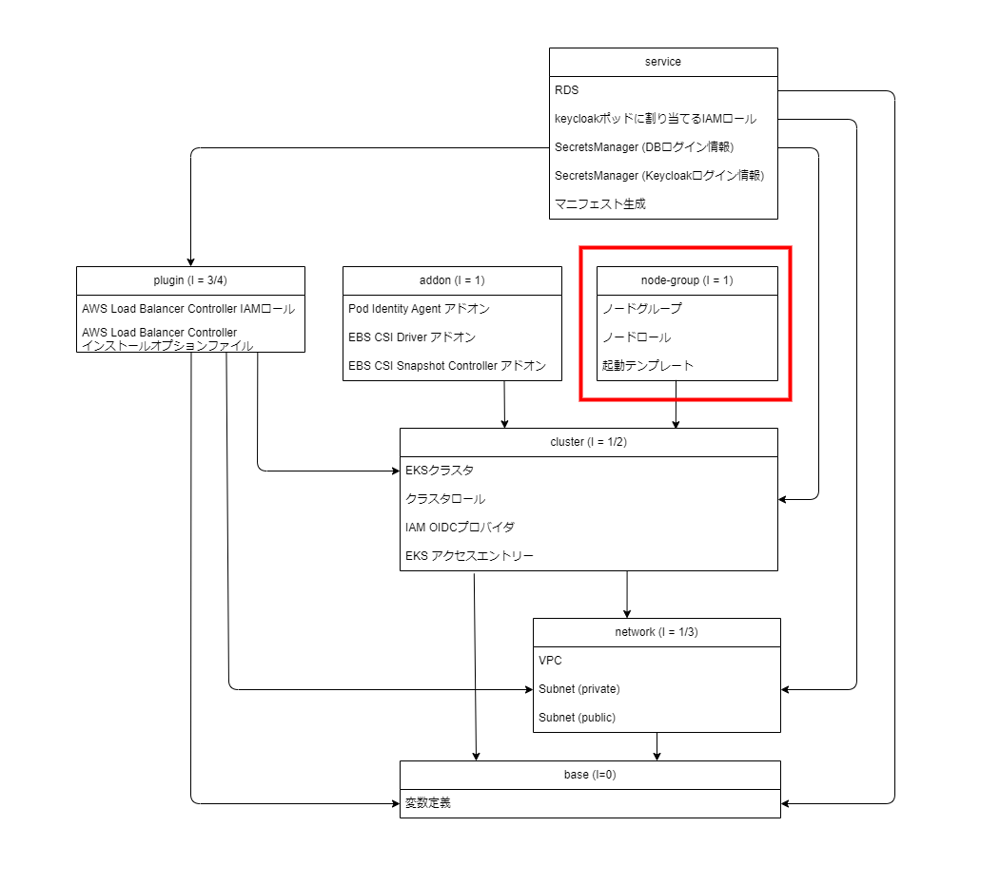

Chapter5 ノードグループ作成
---
[READMEに戻る](../README.md)

# ■ 作るもの

この章ではEKSのノードグループを作成します。

## 構成図


## コンポーネント



# ■ node-group-bottlerocketモジュール

OSにBottlerocketを利用するノードグループを作成するモジュールを定義します。

## モジュールの変数定義

モジュールを呼び出す際に指定する入力値の定義を行います

`cluster_name` EKSクラスタ名
`cluster_version` EKSクラスタのバージョン
`cluster_security_group_id` EKSクラスタセキュリティグループ
`cluster_api_endpoint` EKSクラスタのAPIエンドポイント
`cluster_certificate` EKSクラスタとの通信に必要なBase64エンコードされた証明書
`cluster_subnet_ids` EKSクラスタのサブネット
`node_group_name` 任意のノードグループ名
`ami_type` ノードのAMI。 `BOTTLEROCKET_ARM_64` `BOTTLEROCKET_x86_64` `BOTTLEROCKET_ARM_64_NVIDIA` `BOTTLEROCKET_x86_64_NVIDIA` から選択。
`instance_types` ノードのインスタンスタイプ
`desired_size` ノードの起動数


`terraform/modules/node-group/bottlerocket/variables.tf`

```tf
variable cluster_name {
  type = string
  description = "EKSクラスタ名"
}
variable cluster_version {
  type = string
  description = "Kubernetesバージョン"
}
variable cluster_security_group_id {
  type = string
  description = "EKSクラスタのクラスタセキュリティグループID"
}
variable cluster_api_endpoint {
  type = string
  description = "EKSクラスタのAPIエンドポイント"
}
variable cluster_certificate {
  type = string
  description = "EKSクラスタの証明書"
}
variable cluster_subnet_ids {
  type = list(string)
  description = "EKSクラスタのサブネットID"
}
variable node_group_name {
  type = string
  description = "ノードグループ名"
}
variable ami_type {
  type = string
  description = "ノードのAMIタイプ"
  validation {
    condition = contains([
      "BOTTLEROCKET_ARM_64",
      "BOTTLEROCKET_x86_64",
      "BOTTLEROCKET_ARM_64_NVIDIA",
      "BOTTLEROCKET_x86_64_NVIDIA",
    ], var.ami_type)
    error_message = "Invalid AMI type. Please specify one of the following: BOTTLEROCKET_ARM_64, BOTTLEROCKET_x86_64, BOTTLEROCKET_ARM_64_NVIDIA, BOTTLEROCKET_x86_64_NVIDIA"
  }
}
variable instance_types {
  type = list(string)
  description = "ノードのインスタンスタイプ"
  default = ["m6a.large"]
}
variable desired_size {
  type = number
  description = "起動するノード数"
  default = 1
}

data "aws_eks_cluster" "this" {
  // https://registry.terraform.io/providers/hashicorp/aws/latest/docs/data-sources/eks_cluster
  name = var.cluster_name
}
```

## モジュールのリソースの定義

### ノードロール

EKSのノードとして起動するEC2インスタンスに付与するIAMロールの定義します。

参考: [Amazon EKS ノードの IAM ロール](https://docs.aws.amazon.com/ja_jp/eks/latest/userguide/create-node-role.html)

`terraform/modules/node-group/bottlerocket/main.tf`

```tf
// Amazon EKS ノードの IAM ロール: https://docs.aws.amazon.com/ja_jp/eks/latest/userguide/create-node-role.html#create-worker-node-role
resource "aws_iam_role" "eks_node_role" {
  name = "${var.cluster_name}-${var.node_group_name}-EKSNodeRole"
  assume_role_policy = jsonencode({
    "Version": "2012-10-17",
    "Statement": [
      {
        "Effect": "Allow",
        "Principal": {
          "Service": "ec2.amazonaws.com"
        },
        "Action": "sts:AssumeRole"
      }
    ]
  })
}

resource "aws_iam_role_policy_attachment" "eks_node_policy" {
  for_each = toset([
    "arn:aws:iam::aws:policy/AmazonEKSWorkerNodePolicy",
    "arn:aws:iam::aws:policy/AmazonEC2ContainerRegistryReadOnly",
    "arn:aws:iam::aws:policy/AmazonEKS_CNI_Policy",
    "arn:aws:iam::aws:policy/AmazonSSMManagedInstanceCore"
  ])
  role = aws_iam_role.eks_node_role.name
  policy_arn = each.key
}

resource "aws_iam_policy" "amazoneks_cni_ipv6_policy" {
  name = "${var.cluster_name}-${var.node_group_name}-AmazonEKS_CNI_IPv6_Policy"
  policy = jsonencode({
    "Version": "2012-10-17",
    "Statement": [
      {
        "Effect": "Allow",
        "Action": [
          "ec2:AssignIpv6Addresses",
          "ec2:DescribeInstances",
          "ec2:DescribeTags",
          "ec2:DescribeNetworkInterfaces",
          "ec2:DescribeInstanceTypes"
        ],
        "Resource": "*"
      },
      {
        "Effect": "Allow",
        "Action": [
          "ec2:CreateTags"
        ],
        "Resource": [
          "arn:aws:ec2:*:*:network-interface/*"
        ]
      }
    ]
  })
}

resource "aws_iam_role_policy_attachment" "amazoneks_cni_ipv6_policy" {
  role = aws_iam_role.eks_node_role.name
  policy_arn = aws_iam_policy.amazoneks_cni_ipv6_policy.arn
}
```

### 起動テンプレート

EKSクラスタのノードとして起動するEC2インスタンスの起動テンプレートを定義します。  


`terraform/modules/node-group/bottlerocket/main.tf`

```tf
resource "aws_launch_template" "node_instance" {
  // 起動テンプレート: https://registry.terraform.io/providers/hashicorp/aws/latest/docs/resources/launch_template

  name = "${var.cluster_name}-${var.node_group_name}-EKSNodeLaunchTemplate"

  vpc_security_group_ids = [
    var.cluster_security_group_id,
  ]

  block_device_mappings {
    device_name = "/dev/xvda"
    ebs {
      volume_size = 4
      volume_type = "gp3"
      encrypted = true
      delete_on_termination = true
    }
  }
  block_device_mappings {
    device_name = "/dev/xvdb"
    ebs {
      volume_size = 64
      volume_type = "gp3"
      encrypted = true
      delete_on_termination = true
    }
  }

  monitoring {
    enabled = true
  }

  tag_specifications {
    resource_type = "instance"

    tags = {
      Name = "${var.cluster_name}-${var.node_group_name}"
    }
  }

  // base64エンコードされたユーザーデータを指定
  // Bottlerocket Settings Reference: https://bottlerocket.dev/en/os/1.26.x/api/settings/
  user_data = base64encode(templatefile(
    "${path.module}/user-data.ini",
    {
      cluster_name = var.cluster_name
      api_server = var.cluster_api_endpoint
      cluster_certificate =  var.cluster_certificate
    }
  ))
}
```

ユーザーデータファイル

`terraform/modules/node-group/bottlerocket/user-data.ini`

```ini
[settings]
[settings.kubernetes]
cluster-name = '${cluster_name}'
api-server = '${api_server}'
cluster-certificate = '${cluster_certificate}'
```

### ノードグループ

ノードグループ本体を定義します。

`terraform/modules/node-group/bottlerocket/main.tf`


```tf
resource "aws_eks_node_group" "this" {
  // ノードグループ: https://registry.terraform.io/providers/hashicorp/aws/latest/docs/resources/eks_node_group

  node_group_name = var.node_group_name
  // EKSクラスタ名
  cluster_name    = var.cluster_name
  // Kubernetesバージョン
  version         = var.cluster_version
  // ノードに付与するロール
  node_role_arn   = aws_iam_role.eks_node_role.arn
  // ノードを配置するサブネット
  subnet_ids      = var.cluster_subnet_ids
  // キャパシティタイプ(SPOT, ON_DEMAND)
  capacity_type = "SPOT"  // スポット料金表: https://aws.amazon.com/jp/ec2/spot/pricing/
  // インスタンスタイプ
  instance_types = var.instance_types
  // AMI: https://docs.aws.amazon.com/ja_jp/eks/latest/APIReference/API_Nodegroup.html#AmazonEKS-Type-Nodegroup-amiType
  ami_type = var.ami_type

  scaling_config {
    desired_size = var.desired_size
    max_size     = 10
    min_size     = 1
  }

  // 起動テンプレートの指定
  launch_template {
    id = aws_launch_template.node_instance.id
    version = aws_launch_template.node_instance.latest_version
  }

  update_config {
    // ノード更新時に利用不可能になるノードの最大数
    max_unavailable = 1
  }

  // ロールは作成済みだけど、ポリシーがアタッチされていない状況が発生するので、depends_on でポリシーのアタッチを待つ
  depends_on = [
    aws_iam_role_policy_attachment.eks_node_policy,
    aws_iam_role_policy_attachment.amazoneks_cni_ipv6_policy,
  ]
}
```

# ■ node-groupコンポーネント

先ほど定義したnode-group-bottlerocketモジュールを呼び出し、EKSクラスタにノードグループを作成します。

## 変数定義

必要な変数はclusterコンポーネントから参照します。

`terraform/components/node-group/variables.tf`

```tf
variable tfstate_bucket {
  type = string
  description = "tfvarsが保存されているバケット"
}

variable tfstate_region {
  type = string
  description = "tfvarsが保存されているバケットのリージョン"
}

variable tfstate_cluster_key {
  type = string
  description = "clusterコンポーネントのtfstateファイルのパス"
}

locals {
  cluster_name = data.terraform_remote_state.cluster.outputs.cluster_name
  cluster_version = data.terraform_remote_state.cluster.outputs.version
  cluster_security_group_id = data.terraform_remote_state.cluster.outputs.cluster_security_group_id
  cluster_api_endpoint = data.terraform_remote_state.cluster.outputs.api_endpoint
  cluster_certificate = data.terraform_remote_state.cluster.outputs.cluster_certificate
  cluster_subnet_ids = data.terraform_remote_state.cluster.outputs.subnet_ids
}

data terraform_remote_state "cluster" {
  backend = "s3"

  config = {
    region = var.tfstate_region
    bucket = var.tfstate_bucket
    key    = var.tfstate_cluster_key
  }
}
```

## tfstateとプロバイダの設定

`terraform/components/node-group/main.tf`

```tf
terraform {
  required_version = "~> 1.10"

  backend "s3" {
  }

  required_providers {
    // AWS Provider: https://registry.terraform.io/providers/hashicorp/aws/latest/docs
    aws = {
      source  = "hashicorp/aws"
      version = "~> 5.82.2"
    }
  }
}

// AWS Provider: https://registry.terraform.io/providers/hashicorp/aws/latest/docs
provider "aws" {
  region = "ap-northeast-1"
  default_tags {
    tags = {
      PROJECT = "TERRAFORM_TUTORIAL_EKS",
    }
  }
}
```

## node-group-bottlerocketモジュールの呼び出し

先ほど定義した node-group-bottlerocketモジュールを呼び出します。

`terraform/components/node-group/main.tf`

```tf
/**
 * ノードグループ
 */
module node_group_bottlerocket_1 {
  source = "../../modules/node-group/bottlerocket"
  cluster_name = local.cluster_name
  cluster_version = local.cluster_version
  cluster_security_group_id = local.cluster_security_group_id
  cluster_api_endpoint = local.cluster_api_endpoint
  cluster_certificate = local.cluster_certificate
  cluster_subnet_ids = local.cluster_subnet_ids
  node_group_name = "ng-bottlerocket-1"
  ami_type = "BOTTLEROCKET_x86_64"
  instance_types = ["t3a.xlarge", "t3a.large", "t3a.medium"] // スポット料金: https://aws.amazon.com/jp/ec2/spot/pricing/
  desired_size = 1
}
```

# ■ node-group コンポーネントの入力変数ファイルの作成

※ `EDIT: ...` コメントの項目を各自編集してください

node-groupコンポーネントデプロイ時に入力値と指定する変数をtfvarsファイルにまとめます

`terraform/components/node-group/tfvars/dev.tfvars`

```ini
tfstate_bucket = "terraform-tutorial-eks-tfstate"
tfstate_region = "ap-northeast-1"
tfstate_cluster_key = "クラスタ名/cluster/terraform.tfstate"  # EDIT: クラスタ名を指定
```

# ■ terraformデプロイ

terraformを実行してEKSを作成してみましょう

```bash
# クラスタ名
CLUSTER_NAME=$(terraform -chdir=$PROJECT_DIR/tutorial/terraform/components/base output -raw cluster_name)
# tfstateの保存先を定義した変数ファイル
COMMON_BACKEND_CONFIG=$PROJECT_DIR/tutorial/terraform/components/tfvars/backend.tfvars
# コンポーネント名
COMPONENT_NAME=node-group
# コンポーネントディレクトリ
COMPONENT_DIR=$PROJECT_DIR/tutorial/terraform/components/$COMPONENT_NAME
# コンポーネントの入力変数ファイル
COMPONENT_TFVARS=$COMPONENT_DIR/tfvars/dev.tfvars

# 初期化
# -chdir terraformコマンドを実行するディレクトリ
# -reconfigure tfstateのバックエンド設定を再構成します
# -backend-config tfstateのバックエンド設定をファイルファイルまたは変数で指定します
terraform -chdir=$COMPONENT_DIR init \
  -reconfigure \
  -backend-config $COMMON_BACKEND_CONFIG \
  -backend-config "key=$CLUSTER_NAME/$COMPONENT_NAME/terraform.tfstate"

# デプロイ内容の確認
# -chdir terraformコマンドを実行するディレクトリ
# -var-file terraformの入力変数をファイルで指定します
terraform -chdir=$COMPONENT_DIR plan -var-file $COMPONENT_TFVARS

# デプロイ
# -chdir terraformコマンドを実行するディレクトリ
# -var-file terraformの入力変数をファイルで指定します
# -auto-approve terraformデプロイ時の確認プロンプトをスキップします
terraform -chdir=$COMPONENT_DIR apply -var-file $COMPONENT_TFVARS -auto-approve
```