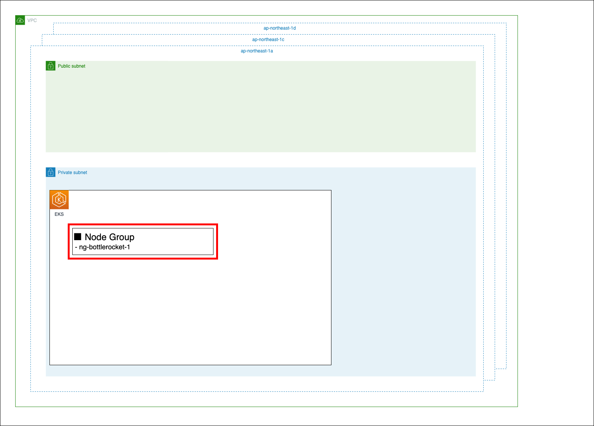

Chapter6 アドオンインストール
---
[READMEに戻る](../README.md)

# ■ 作るもの

この章では以下のEKSのアドオンをインストールします。

- `eks-pod-identity-agent`
- `aws-ebs-csi-driver`
- `snapshot-controller`




# ■ ebs-csi-driverモジュール

ebs-csi-driverアドオンのインストールに必要な付随リソースを作成するモジュールを定義します。


## モジュールの変数定義

`terraform/modules/ebs-csi-driver/variables.tf`

```tf
variable cluster_name {}
```

## モジュールのリソースの定義

ebs-csi-driverのサービスアカウントが利用するIAMロールを定義します。

`terraform/modules/ebs-csi-driver/main.tf`

```tf
resource "aws_iam_role" "ebs_csi_controller_sa_role" {
  name = "${var.cluster_name}-EbsCsiControllerSaRole"
  assume_role_policy = jsonencode({
    "Version": "2012-10-17",
    "Statement": [
        {
            "Sid": "AllowEksAuthToAssumeRoleForPodIdentity",
            "Effect": "Allow",
            "Principal": {
                "Service": "pods.eks.amazonaws.com"
            },
            "Action": [
                "sts:AssumeRole",
                "sts:TagSession"
            ]
        }
    ]
  })
}

resource "aws_iam_role_policy_attachment" "managed_policies" {
  for_each = toset([
    "arn:aws:iam::aws:policy/service-role/AmazonEBSCSIDriverPolicy",
  ])
  role = aws_iam_role.ebs_csi_controller_sa_role.name
  policy_arn = each.key
}

resource "aws_iam_policy" "ebs_csi_driver_encrypt_volume_policy" {
  name = "${var.cluster_name}-EbsCsiDriverEncryptVolumePolicy"
  policy = jsonencode(
    {
      "Version": "2012-10-17",
      "Statement": [
        {
          "Effect": "Allow",
          "Action": [
            "kms:CreateGrant",
            "kms:ListGrants",
            "kms:RevokeGrant"
          ],
          "Resource": ["*"],
          "Condition": {
            "Bool": {
              "kms:GrantIsForAWSResource": "true"
            }
          }
        },
        {
          "Effect": "Allow",
          "Action": [
            "kms:Encrypt",
            "kms:Decrypt",
            "kms:ReEncrypt*",
            "kms:GenerateDataKey*",
            "kms:DescribeKey"
          ],
          "Resource": ["*"]
        }
      ]
    }
  )
}

resource "aws_iam_role_policy_attachment" "ebs_csi_driver_encrypt_volume_policy" {
  role = aws_iam_role.ebs_csi_controller_sa_role.name
  policy_arn = aws_iam_policy.ebs_csi_driver_encrypt_volume_policy.arn
}
```

## モジュールの出力値の定義

作成したIAMロールのARNを出力値として定義します。

`terraform/modules/ebs-csi-driver/outputs.tf`

```tf
output role_arn {
  value = aws_iam_role.ebs_csi_controller_sa_role.arn
}
```


# ■ addonコンポーネント

以下のアドオンをインストールします。

- `eks-pod-identity-agent`
- `aws-ebs-csi-driver`
- `snapshot-controller`


## 変数定義

※ `EDIT: ...` コメントの項目を各自編集してください

`terraform/envs/dev/addon/variables.tf`

```tf
locals {
  cluster_name = data.terraform_remote_state.cluster.outputs.cluster_name
}

data terraform_remote_state "cluster" {
  backend = "s3"

  config = {
    bucket = "terraform-tutorial-eks-tfstate"
    key    = "XXXXX/dev/cluster/terraform.tfstate"  // EDIT: clusterコンポーネントのkeyに設定した値を設定してください
    region = "ap-northeast-1"
    encrypt = true
    dynamodb_table = "terraform-tutorial-eks-tfstate-lock"
  }
}
```

## tfstateとプロバイダの設定

※ `EDIT: ...` コメントの項目を各自編集してください

`terraform/envs/dev/addon/main.tf`

```tf
terraform {
  required_version = "~> 1.10"

  backend "s3" {
    bucket = "terraform-tutorial-eks-tfstate"
    key    = "XXXXX/dev/addon/terraform.tfstate"  // EDIT: XXXXX に重複しない任意の値を指定してください
    region = "ap-northeast-1"
    encrypt = true
    dynamodb_table = "terraform-tutorial-eks-tfstate-lock"
  }

  required_providers {
    // AWS Provider: https://registry.terraform.io/providers/hashicorp/aws/latest/docs
    aws = {
      source  = "hashicorp/aws"
      version = "~> 5.82.2"
    }
  }
}

// AWS Provider: https://registry.terraform.io/providers/hashicorp/aws/latest/docs
provider "aws" {
  region = "ap-northeast-1"
  default_tags {
    tags = {
      PROJECT = "TERRAFORM_TUTORIAL_EKS",
    }
  }
}
```

## Pod Identity Agent

Pod Identity Agentのインストールを定義します。

参考: [Amazon EKS Pod Identity エージェントのセットアップ | AWS](https://docs.aws.amazon.com/ja_jp/eks/latest/userguide/pod-id-agent-setup.html)

最新バージョンは下記コマンドで確認します。

```bash
aws eks describe-addon-versions \
  --addon-name eks-pod-identity-agent \
  --query "addons[0].addonVersions[].addonVersion"
```


`terraform/envs/dev/addon/main.tf`


```tf
/**
 * Pod Identity Agent
 */
resource "aws_eks_addon" "eks_pod_identity_agent" {
  // https://registry.terraform.io/providers/hashicorp/aws/latest/docs/resources/eks_addon

  cluster_name = local.cluster_name
  addon_name   = "eks-pod-identity-agent"
  // バージョンの確認: aws eks describe-addon-versions --addon-name eks-pod-identity-agent
  addon_version = "v1.3.4-eksbuild.1"
}
```

## EBS CSI Driver

EBS CSI Driverのインストールを定義します。  
ebs-csi-driverモジュールを呼び出してIAMロールを作成し、pod-identityの仕組みでサービスアカウントにIAMロールを紐づけます。  
pod-identityの仕組みを利用する都合上、Pod Identity Agentのインストール後にインストールしなければならないので、depends_onに `aws_eks_addon.eks_pod_identity_agent` を設定します。


参考: [Amazon EBS で Kubernetes ボリュームを保存する | AWS](https://docs.aws.amazon.com/ja_jp/eks/latest/userguide/ebs-csi.html)

`terraform/envs/dev/addon/main.tf`


```tf
/**
 * EBS CSI Driver
 */
module ebs_csi_driver {
  source = "../../../modules/ebs-csi-driver"
  cluster_name = local.cluster_name
}

resource "aws_eks_addon" "aws_ebs_csi_driver" {
  cluster_name  = local.cluster_name
  addon_name    = "aws-ebs-csi-driver"
  // バージョンの確認: aws eks describe-addon-versions --addon-name aws-ebs-csi-driver
  addon_version = "v1.37.0-eksbuild.1"
  // Pod Identity に kube-system.ebs-csi-controller-sa に紐づけるIAMロールを指定
  pod_identity_association {
    role_arn = module.ebs_csi_driver.role_arn
    service_account = "ebs-csi-controller-sa"
  }

  depends_on = [ aws_eks_addon.eks_pod_identity_agent ]
}
```

## EBS CSI Snapshot Controller

EBS CSI Snapshot Controllerのインストールを定義します。  

参考: [Amazon EKS クラスターでアドオンを活用し、Amazon EBS スナップショットを永続ストレージに使用する: AWS](https://aws.amazon.com/jp/blogs/news/using-amazon-ebs-snapshots-for-persistent-storage-with-your-amazon-eks-cluster-by-leveraging-add-ons/)


`terraform/envs/dev/addon/main.tf`


```tf
/**
 * EBS CSI Snapshot Controller
 */
resource "aws_eks_addon" "snapshot_controller" {
  cluster_name  = local.cluster_name
  addon_name    = "snapshot-controller"
  // バージョンの確認: aws eks describe-addon-versions --addon-name snapshot-controller
  addon_version = "v8.1.0-eksbuild.2"
}
```

# ■ terraformデプロイ

terraformを実行してアドオンをインストールしましょう

```bash
cd $PROJECT_DIR/tutorial/terraform/envs/dev/addon

# 初期化
terraform init

# デプロイ内容確認
terraform plan

# デプロイ
terraform apply -auto-approve
```
