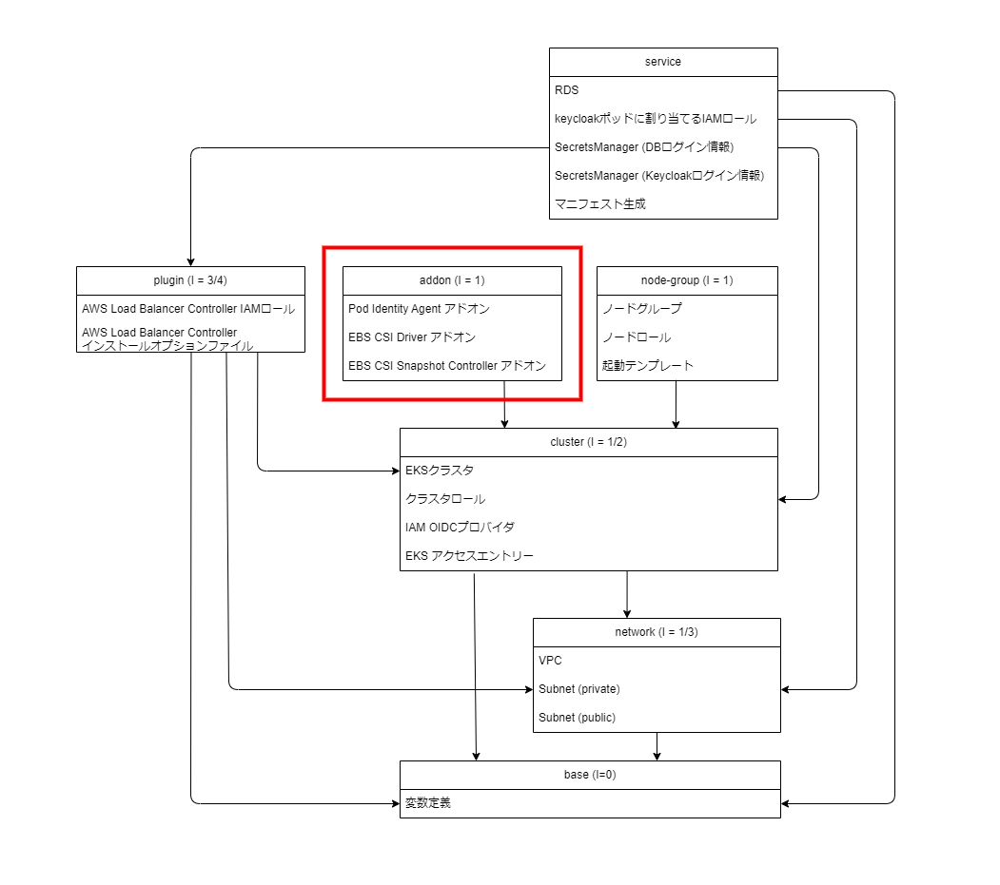

Chapter7 プラグインインストール
---
[READMEに戻る](../README.md)

# ■ 作るもの

この章ではHelmを利用してEKS以下のチャートをインストールします。  
インストールするにあたって必要なAWSリソースはpluginコンポーネントに定義していきます。  

- `aws-load-balancer-controller`
- `metrics-server`
- `secrets-store-csi-driver`
- `secrets-store-csi-driver-provider-aws`


チャートのインストールはコマンドラインで行いますが、インストールに必要なAWSリソースはTerraformで定義します。

## 構成図


## コンポーネント



# ■ albcモジュール

`aws-load-balancer-controller` チャートに必要なAWSリソースを定義するモジュールを定義します。

## モジュールの変数定義

モジュールを呼び出す際に指定する入力値の定義を行います

- `cluster_name` EKSクラスタ名
- `vpc_id` ALBに設定するセキュリティグループ
- `project_dir`
- `ingress_cidr_blocks`

`terraform/modules/plugin/albc/variables.tf`

```tf
variable cluster_name {
  type = string
  description = "EKSクラスタ名"
}
variable vpc_id {
  type = string
  description = "VPC ID"
}
variable project_dir {
  type = string
  description = "プロジェクトディレクトリの絶対パス"
}
variable ingress_cidr_blocks {
  // ALBへのアクセスを許可するCIDR
  type = list(string)
  default = ["0.0.0.0/0"]
  description = "ALBへのアクセスを許可するCIDR"
}

locals {
  namespace = "kube-system"
  service_account = "aws-load-balancer-controller"
  app_version = "v2.11.0"
}

```

## モジュールのリソース定義

### IAMロール

`aws-load-balancer-controller` サービスアカウントに紐づけるIAMロールを定義し、Pod Identityに登録します。  
必要な権限は `https://raw.githubusercontent.com/kubernetes-sigs/aws-load-balancer-controller/v2.11.0/docs/install/iam_policy.json` からダウンロードします。  

参考: [マニフェストを使用して AWS Load Balancer Controller インストールする](https://docs.aws.amazon.com/ja_jp/eks/latest/userguide/lbc-manifest.html)

`terraform/modules/plugin/albc/main.tf`

```tf
/**
 * AWS Load Balancer ControllerがALBを作成するために必要なRoleを作成
 */
resource "aws_iam_role" "albc" {
  name = "${var.cluster_name}-EKSIngressAWSLoadBalancerControllerRole"
  assume_role_policy = jsonencode({
    "Version": "2012-10-17",
    "Statement": [
        {
            "Sid": "AllowEksAuthToAssumeRoleForPodIdentity",
            "Effect": "Allow",
            "Principal": {
                "Service": "pods.eks.amazonaws.com"
            },
            "Action": [
                "sts:AssumeRole",
                "sts:TagSession"
            ]
        }
    ]
  })
}

data "http" "albc" {
  // https://registry.terraform.io/providers/hashicorp/http/latest/docs/data-sources/http

  url = "https://raw.githubusercontent.com/kubernetes-sigs/aws-load-balancer-controller/v2.11.0/docs/install/iam_policy.json"
  request_headers = {
    Accept = "application/json"
  }
}

resource "aws_iam_policy" "albc" {
  name   = "${var.cluster_name}-AwsLoadBalancerControllerPolicy"
  policy = data.http.albc.response_body
}

resource "aws_iam_role_policy_attachment" "albc" {
  role = aws_iam_role.albc.name
  policy_arn = aws_iam_policy.albc.arn
}

resource "aws_eks_pod_identity_association" "albc" {
  // https://registry.terraform.io/providers/hashicorp/aws/latest/docs/resources/eks_pod_identity_association

  cluster_name    = var.cluster_name
  namespace       = local.namespace
  service_account = local.service_account
  role_arn        = aws_iam_role.albc.arn
}
```

### セキュリティグループ

ALBに紐づけるセキュリティグループを定義します。


`terraform/modules/plugin/albc/main.tf`

```tf
/**
 * ALB のセキュリティグループ
 */
resource "aws_security_group" "alb_ingress" {
  name        = "${var.cluster_name}-AlbIngres"
  description = "Allow HTTP, HTTPS access."
  vpc_id      = var.vpc_id

  ingress {
    description = "Allow HTTP access."
    from_port   = 80
    to_port     = 80
    protocol    = "tcp"
    cidr_blocks = var.ingress_cidr_blocks
  }

  ingress {
    description = "Allow HTTPS access."
    from_port   = 443
    to_port     = 443
    protocol    = "tcp"
    cidr_blocks = var.ingress_cidr_blocks
  }

  egress {
    from_port        = 0
    to_port          = 0
    protocol         = "-1"
    cidr_blocks      = ["0.0.0.0/0"]
    ipv6_cidr_blocks = ["::/0"]
  }

  tags = {
    Name = "${var.cluster_name}-AlbIngres"
  }
}
```

### values.yaml

Helmでalbcをインストールする際に指定するvalues.yamlファイルを動的に生成します。

`terraform/modules/plugin/albc/main.tf`

```tf
/**
 * ALBCをHelmでインストールするためのvalues.yaml
 */
resource "local_file" "albc_values" {
  filename = "${var.project_dir}/plugin/albc/tmp/values.yaml"
  content = templatefile(
    "${path.module}/values.yaml",
    {
      cluster_name = var.cluster_name
      service_account = local.service_account
      security_group_id = aws_security_group.alb_ingress.id
      role_arn = aws_iam_role.albc.arn
      image_tag = local.app_version
      vpc_id = var.vpc_id
    }
  )
}
```

values.yamlのテンプレートファイル

`terraform/modules/plugin/albc/values.yaml`

```yml
clusterName: ${cluster_name}
serviceAccount:
  create: true
  name: ${service_account}
  annotations:
    eks.amazonaws.com/role-arn: ${role_arn}
image:
  repository: public.ecr.aws/eks/aws-load-balancer-controller
  tag: ${image_tag}
region: ap-northeast-1
vpcId: ${vpc_id}
```

## モジュールの出力値の定義

`terraform/modules/plugin/albc/outputs.tf`

```tf
output "alb_ingress_sg" {
  value = aws_security_group.alb_ingress.id
}
```


# ■ pluginコンポーネント

ServiceコンポーネントはKubernetesのプラグインのインストールに必要なAWSリソースを定義するためのコンポーネントです。

## 変数定義

必要な変数はbase, network, clusterコンポーネントから参照します。

`terraform/components/plugin/variables.tf`

```tf
variable tfstate_bucket {
  type = string
  description = "tfvarsが保存されているバケット"
}

variable tfstate_region {
  type = string
  description = "tfvarsが保存されているバケットのリージョン"
}

variable tfstate_base_key {
  type = string
  description = "baseコンポーネントのtfstateファイルのパス"
}

variable tfstate_network_key {
  type = string
  description = "networkコンポーネントのtfstateファイルのパス"
}

variable tfstate_cluster_key {
  type = string
  description = "clusterコンポーネントのtfstateファイルのパス"
}

locals {
  project_dir = data.terraform_remote_state.base.outputs.project_dir
  cluster_name = data.terraform_remote_state.cluster.outputs.cluster_name
  vpc_id = data.terraform_remote_state.network.outputs.vpc_id
}

data terraform_remote_state "base" {
  backend = "s3"

  config = {
    region = var.tfstate_region
    bucket = var.tfstate_bucket
    key    = var.tfstate_base_key
  }
}

data "terraform_remote_state" "network" {
  // https://developer.hashicorp.com/terraform/language/state/remote-state-data#argument-reference
  backend = "s3"

  config = {
    region = var.tfstate_region
    bucket = var.tfstate_bucket
    key    = var.tfstate_network_key
  }
}

data terraform_remote_state "cluster" {
  backend = "s3"

  config = {
    region = var.tfstate_region
    bucket = var.tfstate_bucket
    key    = var.tfstate_cluster_key
  }
}
```

## tfstateとプロバイダの設定

`terraform/components/plugin/main.tf`

```tf
terraform {
  required_version = "~> 1.10"

  backend "s3" {
  }

  required_providers {
    // AWS Provider: https://registry.terraform.io/providers/hashicorp/aws/latest/docs
    aws = {
      source  = "hashicorp/aws"
      version = "~> 5.82.2"
    }
  }
}

// AWS Provider: https://registry.terraform.io/providers/hashicorp/aws/latest/docs
provider "aws" {
  region = "ap-northeast-1"
  default_tags {
    tags = {
      PROJECT = "TERRAFORM_TUTORIAL_EKS",
    }
  }
}
```

## albcモジュールの呼び出し

先ほど定義した albcモジュールを呼び出します。

`terraform/components/plugin/main.tf`

```tf
module albc {
  source = "../../modules/plugin/albc"
  cluster_name = local.cluster_name
  vpc_id = local.vpc_id
  project_dir = local.project_dir
}
```

## 出力値の定義

`terraform/components/plugin/main.tf`

```tf
output "alb_ingress_sg" {
  value = module.albc.alb_ingress_sg
}
```

# ■ plugin コンポーネントの入力変数ファイルの作成

※ `EDIT: ...` コメントの項目を各自編集してください

plugin コンポーネントデプロイ時に入力値と指定する変数をtfvarsファイルにまとめます

`terraform/components/plugin/tfvars/dev.tfvars`

```ini
tfstate_bucket = "terraform-tutorial-eks-tfstate"
tfstate_region = "ap-northeast-1"
tfstate_base_key = "クラスタ名/base/terraform.tfstate"  # EDIT: クラスタ名を指定
tfstate_network_key = "クラスタ名/network/terraform.tfstate"  # EDIT: クラスタ名を指定
tfstate_cluster_key = "クラスタ名/cluster/terraform.tfstate"  # EDIT: クラスタ名を指定
```


# ■ terraformデプロイ

terraformを実行してチャートのインストールに必要なAWSリソースを作成しましょう

```bash
# クラスタ名
CLUSTER_NAME=$(terraform -chdir=$PROJECT_DIR/tutorial/terraform/components/base output -raw cluster_name)
# tfstateの保存先を定義した変数ファイル
COMMON_BACKEND_CONFIG=$PROJECT_DIR/tutorial/terraform/components/tfvars/dev.backend.tfvars
# コンポーネント名
COMPONENT_NAME=plugin
# コンポーネントディレクトリ
COMPONENT_DIR=$PROJECT_DIR/tutorial/terraform/components/$COMPONENT_NAME
# コンポーネントの入力変数ファイル
COMPONENT_TFVARS=$COMPONENT_DIR/tfvars/dev.tfvars

# 初期化
# -chdir terraformコマンドを実行するディレクトリ
# -reconfigure tfstateのバックエンド設定を再構成します
# -backend-config tfstateのバックエンド設定をファイルファイルまたは変数で指定します
terraform -chdir=$COMPONENT_DIR init \
  -reconfigure \
  -backend-config $COMMON_BACKEND_CONFIG \
  -backend-config "key=$CLUSTER_NAME/$COMPONENT_NAME/terraform.tfstate"

# デプロイ内容の確認
# -chdir terraformコマンドを実行するディレクトリ
# -var-file terraformの入力変数をファイルで指定します
terraform -chdir=$COMPONENT_DIR plan -var-file $COMPONENT_TFVARS

# デプロイ
# -chdir terraformコマンドを実行するディレクトリ
# -var-file terraformの入力変数をファイルで指定します
# -auto-approve terraformデプロイ時の確認プロンプトをスキップします
terraform -chdir=$COMPONENT_DIR apply -var-file $COMPONENT_TFVARS -auto-approve
```

# ■ aws-load-balancer-controller のインストール

AWS Load Balancer ControllerはKubernetesクラスタがELBを管理するためのコントローラで、IngressリソースでALBをプロビジョニングすることができます。

Terraformで生成したvalues.yamlを指定してチャートをインストールします。

- [Install AWS Load Balancer Controller with Helm](https://docs.aws.amazon.com/eks/latest/userguide/lbc-helm.html)
- [AWS Load Balancer Controller v2.11.0](https://kubernetes-sigs.github.io/aws-load-balancer-controller/v2.11/)
- [kubernetes-sigs/aws-load-balancer-controller | GitHub](https://github.com/kubernetes-sigs/aws-load-balancer-controller)

```bash
# リポジトリ追加
helm repo add eks https://aws.github.io/eks-charts

# リポジトリのアップデート
helm repo update eks

# チャートの最新バージョンチェック
# CHART_VERSION=$(helm show chart eks/aws-load-balancer-controller | yq -r ".version")
# echo $CHART_VERSION

# インストール
helm upgrade --install aws-load-balancer-controller eks/aws-load-balancer-controller \
  --version "1.11.0" \
  --namespace "kube-system" \
  --create-namespace \
  --values $PROJECT_DIR/tutorial/plugin/albc/tmp/values.yaml
```

# ■ metrics-server のインストール

metrics-serverはEKSでHorizontal Pod Autoscaler (Podの水平スケーリング)を利用するために必要なチャートです。

- [Horizontal Pod Autoscaler を使用してポッドデプロイをスケールする | AWS](https://docs.aws.amazon.com/ja_jp/eks/latest/userguide/horizontal-pod-autoscaler.html)
- [kubernetes-sigs/metrics-server | GitHub](https://github.com/kubernetes-sigs/metrics-server)
- [metrics-server - Helm Chart | ArtifactHUB](https://artifacthub.io/packages/helm/metrics-server/metrics-server)

```bash
# リポジトリ追加
helm repo add metrics-server https://kubernetes-sigs.github.io/metrics-server/

# リポジトリのアップデート
helm repo update metrics-server

# チャートの最新バージョンチェック
# CHART_VERSION=$(helm show chart metrics-server/metrics-server | yq -r ".version")
# echo $CHART_VERSION


# インストール
helm upgrade --install metrics-server metrics-server/metrics-server \
  --version "3.12.2" \
  --namespace "kube-system" \
  --create-namespace
```

# ■ secrets-store-csi-driver と secrets-store-csi-driver-provider-aws のインストール

secrets-store-csi-driver と secrets-store-csi-driver-provider-aws はEKSでSecretsManagerに保存されているシークレットを利用するために必要なチャートです。

## Secrets Store CSI Driver

- [Kubernetes Secrets Store CSI Driver](https://secrets-store-csi-driver.sigs.k8s.io/)
- [Amazon Elastic Kubernetes Service で AWS Secrets Manager シークレットを使用する](https://docs.aws.amazon.com/ja_jp/secretsmanager/latest/userguide/integrating_csi_driver.html)


```bash
# リポジトリ追加
helm repo add secrets-store-csi-driver https://kubernetes-sigs.github.io/secrets-store-csi-driver/charts

# リポジトリのアップデート
helm repo update

# チャートの最新バージョンのチェック
# CHART_VERSION=$(helm show chart secrets-store-csi-driver/secrets-store-csi-driver | yq -r ".version")
# echo $CHART_VERSION

# インストール
helm upgrade --install csi-secrets-store secrets-store-csi-driver/secrets-store-csi-driver \
  --version "1.4.7" \
  --namespace kube-system \
  --create-namespace \
  --set "syncSecret.enabled=true" \
  --set "enableSecretRotation=true"
```

## ASCP (aws secrets store csi provider)

- [secrets-store-csi-driver-provider-aws | GitHub](https://github.com/aws/secrets-store-csi-driver-provider-aws)
- [Amazon Elastic Kubernetes Service で AWS Secrets Manager シークレットを使用する](https://docs.aws.amazon.com/ja_jp/secretsmanager/latest/userguide/integrating_csi_driver.html)


```bash
# リポジトリ追加
helm repo add aws-secrets-manager https://aws.github.io/secrets-store-csi-driver-provider-aws

# リポジトリのアップデート
helm repo update

# チャートの最新バージョンのチェック
# CHART_VERSION=$(helm show chart aws-secrets-manager/secrets-store-csi-driver-provider-aws | yq -r ".version")
# echo $CHART_VERSION

# インストール
helm upgrade --install secrets-provider-aws aws-secrets-manager/secrets-store-csi-driver-provider-aws \
  --version "0.3.10" \
  --namespace kube-system \
  --create-namespace
```

# ■ 確認

k9sで以下を確認します

- kube-systemネームスペースのdeploymentに `aws-load-balancer-controller` が存在する
- kube-systemネームスペースのdeploymentに `metrics-server` が存在する
- kube-systemネームスペースのdaemonsetに `csi-secrets-store-secrets-store-csi-driver` `secrets-provider-aws-secrets-store-csi-driver-provider-aws` が存在する
- aws-load-balancer-controllerサービスアカウントのAnnotationsに ` eks.amazonaws.com/role-arn: arn:aws:iam::111111111111:role/xxxxx-dev-EKSIngressAWSLoadBalancerControllerRole` が設定されている