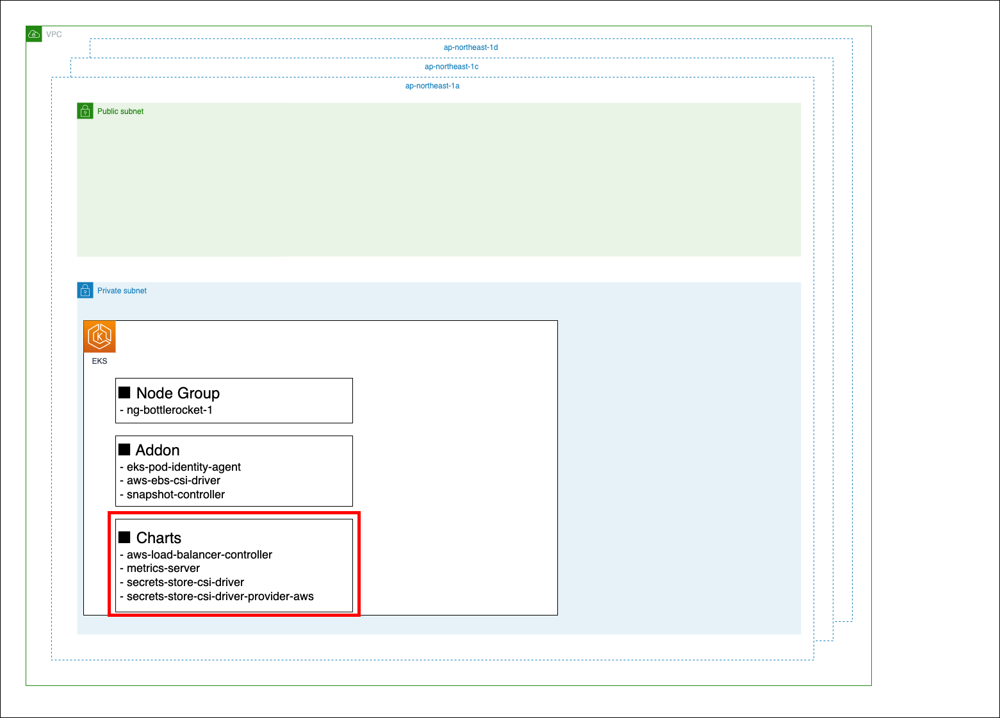
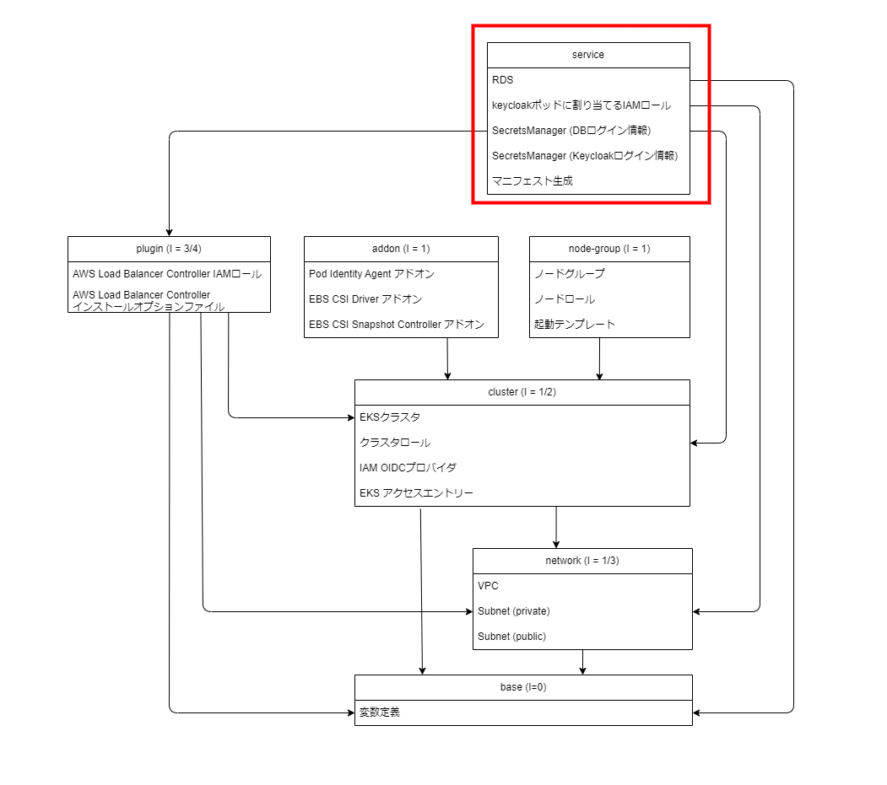

Chapter8 keycloakの構築
---
[READMEに戻る](../README.md)

# ■ 作るもの

この章ではこれまで作成してきたEKSにKeycloakアプリケーションをデプロイします。  
KeycloakのデプロイだけではなくRDSやSecretsManagerといった周辺リソースの作成まで行います。  
これらのリソースは、EKSにデプロイするアプリケーションに付随するAWSリソースを定義するためのserviceコンポーネントに定義していきます。

## 構成図



## コンポーネント



# ■ keycloakモジュール

Keycloakのデプロイに必要な周辺AWSリソースの作成と、マニフェストファイルの動的生成を行うモジュールを定義します。

## モジュールの変数定義

モジュールを呼び出す際に指定する入力値の定義を行います

- ``
- `cluster_name` EKSクラスタ名
- `cluster_oidc_provider` IRSAで利用するOIDCプロバイダ
- `cluster_security_group_id` EKSクラスタセキュリティグループ
- `alb_ingress_sg` ALBのセキュリティグループ
- `vpc_id` VPCのID
- `private_subnet_ids` プライベートサブネットID
- `project_dir` プロジェクトディレクトリ絶対パス

`terraform/modules/keycloak/variables.tf`

```tf
variable "cluster_name" {}
variable "cluster_oidc_provider" {}
variable "cluster_security_group_id" {}
variable "alb_ingress_sg" {}
variable "vpc_id" {}
variable "private_subnet_ids" {}
variable "project_dir" {}

locals {
  account_id = data.aws_caller_identity.this.account_id
  aws_region = data.aws_region.this.name
  namespace = "keycloak"
  service_account = "keycloak"
  db_user = "admin"
  db_name = "keycloak"
}

data "aws_caller_identity" "this" {}

data "aws_region" "this" {}
```

## モジュールのリソース定義

### IAMロール

`keycloak` のポッドを動かすサービスアカウントとサービスアカウントに紐づけるIAMロールを作成します。  
ポリシーには、SecretsManagerからDBのログイン情報と初期ユーザー情報を取得するための `secretsmanager:GetSecretValue` `secretsmanager:DescribeSecret` 権限を付与します。


`terraform/modules/keycloak/main.tf`

```tf
/**
 * サービスアカウントに紐づけるIAMロールの作成
 */
resource "aws_iam_role" "keycloak" {
  name = "${var.cluster_name}-KeycloakRole"
  assume_role_policy = jsonencode({
    "Version": "2012-10-17"
    "Statement": {
      "Effect": "Allow",
      "Principal": {
        "Federated": "arn:aws:iam::${local.account_id}:oidc-provider/${var.cluster_oidc_provider}"
      },
      "Action": "sts:AssumeRoleWithWebIdentity",
      "Condition": {
        "StringLike": {
          "${var.cluster_oidc_provider}:sub": "system:serviceaccount:${local.namespace}:${local.service_account}",
          "${var.cluster_oidc_provider}:aud": "sts.amazonaws.com"
        }
      }
    }
  })
}

resource "aws_iam_policy" "keycloak" {
  name = "${var.cluster_name}-KeycloakPolicy"
  policy = jsonencode({
    "Version": "2012-10-17",
    "Statement": [
      {
        "Effect": "Allow",
        "Action": [
          "secretsmanager:GetSecretValue",
          "secretsmanager:DescribeSecret"
        ],
        "Resource": [
          "arn:aws:secretsmanager:${local.aws_region}:${local.account_id}:secret:/${var.cluster_name}/*"
        ]
      }
    ]
  })
}

resource "aws_iam_role_policy_attachment" "keycloak" {
  role = aws_iam_role.keycloak.name
  policy_arn = aws_iam_policy.keycloak.arn
}
```

### keycloakのログイン情報を管理するSecretsManager

terraform組み込みの[randomプロバイダ](https://registry.terraform.io/providers/hashicorp/random/latest)の [random_passwordリソース](https://registry.terraform.io/providers/hashicorp/random/latest/docs/resources/password)を利用して、keycloak初期化時に作成されるadminユーザーのログインIDとパスワードを生成し、SecretsManage登録します。


`terraform/modules/keycloak/main.tf`

```tf
/**
 * Keycloakのadminログイン情報を保持する SecretsManager
 */
resource "random_password" "keycloak_user" {
  // https://registry.terraform.io/providers/hashicorp/random/latest/docs/resources/password

  length           = 32
  lower            = true  # 小文字を文字列に含める
  numeric          = true  # 数値を文字列に含める
  upper            = true  # 大文字を文字列に含める
  special          = false # 記号を文字列に含める
}

resource "random_password" "keycloak_password" {
  length           = 32
  lower            = true  # 小文字を文字列に含める
  numeric          = true  # 数値を文字列に含める
  upper            = true  # 大文字を文字列に含める
  special          = true  # 記号を文字列に含める
  override_special = "@_=+-"  # 記号で利用する文字列を指定 (default: !@#$%&*()-_=+[]{}<>:?)
}

resource "aws_secretsmanager_secret" "keycloak_admin_user" {
  // https://registry.terraform.io/providers/hashicorp/aws/latest/docs/resources/secretsmanager_secret

  name = "/${var.cluster_name}/keycloak"
  recovery_window_in_days = 0
  force_overwrite_replica_secret = true
}

resource "aws_secretsmanager_secret_version" "keycloak_admin_user" {
  // https://registry.terraform.io/providers/hashicorp/aws/latest/docs/resources/secretsmanager_secret_version

  secret_id = aws_secretsmanager_secret.keycloak_admin_user.id
  secret_string = jsonencode({
    user = random_password.keycloak_user.result
    password = random_password.keycloak_password.result
  })
}
```

### RDSとその接続情報を保持するSecretsManagerを作成

keycloakが利用するデータベースとそのログイン情報を管理するSecretsManagerを定義します。


`terraform/modules/keycloak/main.tf`

```tf
/**
 * RDS
 */
resource "aws_security_group" "app_db_sg" {
  // https://registry.terraform.io/providers/hashicorp/aws/latest/docs/resources/security_group

  name = "${var.cluster_name}-keycloak-db"
  vpc_id = var.vpc_id
  egress {
    from_port   = 0
    to_port     = 0
    protocol    = "-1"
    security_groups = [var.cluster_security_group_id]
  }
  ingress {
    from_port = 3306
    to_port = 3306
    protocol = "tcp"
    // EKSクラスタのセキュリティグループからのアクセスを許可
    security_groups = [var.cluster_security_group_id]
  }
  tags = {
    "Name" = "${var.cluster_name}-keycloak-db"
  }
}

resource "aws_db_parameter_group" "app_db_pg" {
  // MySQLのパラメータの確認: aws rds describe-engine-default-parameters --db-parameter-group-family mysql8.0
  // https://registry.terraform.io/providers/hashicorp/aws/latest/docs/resources/db_parameter_group

  name = "${var.cluster_name}-keycloak-db"
  family = "mysql8.0"
  parameter {
    name = "character_set_client"
    value = "utf8mb4"
  }
  parameter {
    name = "character_set_connection"
    value = "utf8mb4"
  }
  parameter {
    name = "character_set_database"
    value = "utf8mb4"
  }
  parameter {
    name = "character_set_filesystem"
    value = "utf8mb4"
  }
  parameter {
    name = "character_set_results"
    value = "utf8mb4"
  }
  parameter {
    name = "character_set_server"
    value = "utf8mb4"
  }
  parameter {
    name = "collation_connection"
    value = "utf8mb4_bin"
  }
  parameter {
    name = "collation_server"
    value = "utf8mb4_bin"
  }
}

resource "aws_db_subnet_group" "app_db_subnet_group" {
  // https://registry.terraform.io/providers/hashicorp/aws/latest/docs/resources/db_subnet_group

  name       = "${var.cluster_name}-keycloak-db"
  subnet_ids = var.private_subnet_ids
}

resource "random_password" "db_password" {
  length           = 16
  lower            = true  # 小文字を文字列に含める
  numeric          = true  # 数値を文字列に含める
  upper            = true  # 大文字を文字列に含める
  special          = true  # 記号を文字列に含める
  override_special = "@_=+-"  # 記号で利用する文字列を指定 (default: !@#$%&*()-_=+[]{}<>:?)
}

resource "aws_db_instance" "app_db" {
  // https://registry.terraform.io/providers/hashicorp/aws/latest/docs/resources/db_instance

  identifier = "${var.cluster_name}-keycloak-db"
  storage_encrypted = true
  engine               = "mysql"
  allocated_storage    = 20
  max_allocated_storage = 100
  db_name              = local.db_name
  engine_version       = "8.0"
  instance_class       = "db.t3.micro"
  db_subnet_group_name = aws_db_subnet_group.app_db_subnet_group.name
  backup_retention_period = 30
  enabled_cloudwatch_logs_exports = ["error", "general", "slowquery"]
  multi_az = false
  parameter_group_name = aws_db_parameter_group.app_db_pg.name
  port = 3306
  vpc_security_group_ids = [aws_security_group.app_db_sg.id]
  storage_type = "gp3"
  network_type = "IPV4"
  username = local.db_user
  password = random_password.db_password.result
  skip_final_snapshot  = true
  deletion_protection = false
  lifecycle {
    // terraformから削除されたくない場合はコメントイン
    #prevent_destroy = true
  }
}


/**
 * RDS のログイン情報を保持する SecretsManager
 */
resource "aws_secretsmanager_secret" "app_db_secret" {
  name = "/${var.cluster_name}/db"
  recovery_window_in_days = 0
  force_overwrite_replica_secret = true
}

resource "aws_secretsmanager_secret_version" "app_db_secret_version" {
  secret_id = aws_secretsmanager_secret.app_db_secret.id
  secret_string = jsonencode({
    db_user = local.db_user
    db_password = random_password.db_password.result
    db_host = aws_db_instance.app_db.address
    db_port = tostring(aws_db_instance.app_db.port)
    db_name = local.db_name
  })
}
```


### マニフェストファイル

keycloakをKubernetesにapplyするためのマニフェストファイルを動的に生成します。  
生成されたマニフェストファイルは `$PROJECT_DIR/tutorial/service/keycloak/tmp/app.yaml` に出力されます。


`terraform/modules/keycloak/main.tf`

```tf
/**
 * マニフェストファイルの生成
 */
resource "local_file" "keycloak_manifest" {
  filename = "${var.project_dir}/service/keycloak/tmp/app.yaml"
  content = templatefile(
    "${path.module}/app.yaml",
    {
      namespace = local.namespace,
      service_account = local.service_account,
      role_arn = aws_iam_role.keycloak.arn,
      db_secret_name = aws_secretsmanager_secret.app_db_secret.name,
      user_secret_name = aws_secretsmanager_secret.keycloak_admin_user.name
      alb_ingress_sg = var.alb_ingress_sg
    }
  )
}
```

マニフェストファイルのテンプレート

`terraform/modules/keycloak/app.yaml`

```yml
---
apiVersion: v1
kind: Namespace
metadata:
  name: ${namespace}
---
apiVersion: v1
kind: ServiceAccount
metadata:
  name: ${service_account}
  namespace: ${namespace}
  annotations:
    eks.amazonaws.com/role-arn: ${role_arn}
---
#
# Keycloakのデータベース接続情報をSecrets Managerから取得する
#
apiVersion: secrets-store.csi.x-k8s.io/v1
kind: SecretProviderClass
metadata:
  name: keycloak-db-spc
  namespace: ${namespace}
spec:
  provider: aws
  secretObjects:
    - secretName: keycloak-db-secret
      type: Opaque
      data:
        - key: kc_db_host
          objectName: alias_db_host
        - key: kc_db_port
          objectName: alias_db_port
        - key: kc_db_user
          objectName: alias_db_user
        - key: kc_db_password
          objectName: alias_db_password
        - key: kc_db_name
          objectName: alias_db_name
  parameters:
    # jmesPathを利用する場合JSONの値はString型である必要がある
    objects: |
        - objectName: "${db_secret_name}"
          objectType: "secretsmanager"
          jmesPath:
            - path: db_host
              objectAlias: alias_db_host
            - path: db_port
              objectAlias: alias_db_port
            - path: db_user
              objectAlias: alias_db_user
            - path: db_password
              objectAlias: alias_db_password
            - path: db_name
              objectAlias: alias_db_name
---
#
# Keycloakの管理ユーザログイン情報をSecrets Managerから取得する
#
apiVersion: secrets-store.csi.x-k8s.io/v1
kind: SecretProviderClass
metadata:
  name: keycloak-user-spc
  namespace: ${namespace}
spec:
  provider: aws
  secretObjects:
    - secretName: keycloak-user-secret
      type: Opaque
      data:
        - key: keycloak_admin
          objectName: alias_user
        - key: keycloak_admin_password
          objectName: alias_password
  parameters:
    objects: |
        - objectName: "${user_secret_name}"
          objectType: "secretsmanager"
          jmesPath:
            - path: user
              objectAlias: alias_user
            - path: password
              objectAlias: alias_password
---
apiVersion: apps/v1
kind: Deployment
metadata:
  name: keycloak
  namespace: ${namespace}
  labels:
    app: keycloak
spec:
  replicas: 1
  selector:
    matchLabels:
      app: keycloak
  template:
    metadata:
      labels:
        app: keycloak
    spec:
      serviceAccountName: ${service_account}

      volumes:
        - name: keycloak-user-secret-volume
          csi:
            driver: secrets-store.csi.k8s.io
            readOnly: true
            volumeAttributes:
              secretProviderClass: keycloak-user-spc
        - name: keycloak-db-secret-volume
          csi:
            driver: secrets-store.csi.k8s.io
            readOnly: true
            volumeAttributes:
              secretProviderClass: keycloak-db-spc
      containers:
        #- name: debug
        #  image: amazon/aws-cli
        #  command: ["sleep", "3600"]
        - name: keycloak
          image: quay.io/keycloak/keycloak:25.0.1
          args: ["start"]
          env:
            # All Configuration | Keycloak: https://www.keycloak.org/server/all-config
            - name: KC_PROXY_HEADERS  # リバースプロキシを利用する場合の設定: https://www.keycloak.org/server/reverseproxy
              value: "xforwarded"
            - name: KEYCLOAK_ADMIN
              valueFrom:
                secretKeyRef:
                  name: keycloak-user-secret
                  key: keycloak_admin
            - name: KEYCLOAK_ADMIN_PASSWORD
              valueFrom:
                secretKeyRef:
                  name: keycloak-user-secret
                  key: keycloak_admin_password
            - name: KC_DB
              value: "mysql"
            - name: KC_DB_URL_DATABASE
              valueFrom:
                secretKeyRef:
                  name: keycloak-db-secret
                  key: kc_db_name
            - name: KC_DB_URL_HOST
              valueFrom:
                secretKeyRef:
                  name: keycloak-db-secret
                  key: kc_db_host
            - name: KC_DB_URL_PORT
              valueFrom:
                secretKeyRef:
                  name: keycloak-db-secret
                  key: kc_db_port
            - name: KC_DB_USERNAME
              valueFrom:
                secretKeyRef:
                  name: keycloak-db-secret
                  key: kc_db_user
            - name: KC_DB_PASSWORD
              valueFrom:
                secretKeyRef:
                  name: keycloak-db-secret
                  key: kc_db_password
            - name: KC_HOSTNAME_STRICT
              value: "false"
            - name: KC_HTTP_ENABLED  # プロダクションモードではHTTPが無効になるので、明示的にHTTPを有効にする
              value: "true"
          ports:
            - name: http
              containerPort: 8080
          readinessProbe:
            httpGet:
              path: /realms/master
              port: 8080
          volumeMounts:
            - name: keycloak-user-secret-volume
              mountPath: /mnt/keycloak-user-secret-store
              readOnly: true
            - name: keycloak-db-secret-volume
              mountPath: /mnt/keycloak-db-secret-store
              readOnly: true
---
apiVersion: v1
kind: Service
metadata:
  name: keycloak-svc
  namespace: ${namespace}
  labels:
    app: keycloak
spec:
  ports:
    - name: http
      port: 8080
      targetPort: 8080
  selector:
    app: keycloak
---
apiVersion: networking.k8s.io/v1
kind: Ingress
metadata:
  name: keycloak-alb
  namespace: ${namespace}
  # Ingress annotations - AWS Load Balancer Controller
  # https://kubernetes-sigs.github.io/aws-load-balancer-controller/v2.4/guide/ingress/annotations/
  annotations:
    alb.ingress.kubernetes.io/scheme: internet-facing
    alb.ingress.kubernetes.io/target-type: ip
    alb.ingress.kubernetes.io/tags: "PROJECT=TERRAFORM_TUTORIAL_EKS"
    alb.ingress.kubernetes.io/listen-ports: '[{"HTTP":80}]'
    alb.ingress.kubernetes.io/security-groups: ${alb_ingress_sg}
    alb.ingress.kubernetes.io/manage-backend-security-group-rules: "true"
    alb.ingress.kubernetes.io/healthcheck-path: /realms/master
spec:
  ingressClassName: alb
  rules:
    - http:
        paths:
          - path: /
            pathType: Prefix
            backend:
              service:
                name: keycloak-svc
                port:
                  number: 8080
```

# ■ Service コンポーネント

ServiceコンポーネントはEKS上にデプロイされるアプリケーションの付随リソースを定義するためのコンポーネントです。

## 変数定義

必要な変数はbase, network, cluster, pluginコンポーネントから参照します。

※ `EDIT: ...` コメントの項目を各自編集してください

`terraform/envs/dev/service/variables.tf`

```tf
locals {
  cluster_name = data.terraform_remote_state.base.outputs.cluster_name
  alb_ingress_sg = data.terraform_remote_state.plugin.outputs.alb_ingress_sg
  vpc_id = data.terraform_remote_state.network.outputs.vpc_id
  private_subnet_ids = data.terraform_remote_state.network.outputs.private_subnet_ids
  oidc_provider = data.terraform_remote_state.cluster.outputs.oidc_provider
  cluster_security_group_id = data.terraform_remote_state.cluster.outputs.cluster_security_group_id
  project_dir = data.terraform_remote_state.base.outputs.project_dir
}

data "terraform_remote_state" "base" {
  backend = "s3"

  config = {
    bucket = "terraform-tutorial-eks-tfstate"
    key    = "XXXXX/dev/base/terraform.tfstate"  // EDIT: baseコンポーネントのkeyに設定した値を設定してください
    region = "ap-northeast-1"
    encrypt = true
    dynamodb_table = "terraform-tutorial-eks-tfstate-lock"
  }
}

data "terraform_remote_state" "network" {
  backend = "s3"

  config = {
    bucket = "terraform-tutorial-eks-tfstate"
    key    = "XXXXX/dev/network/terraform.tfstate"  // EDIT: networkコンポーネントのkeyに設定した値を設定してください
    region = "ap-northeast-1"
    encrypt = true
    dynamodb_table = "terraform-tutorial-eks-tfstate-lock"
  }
}

data "terraform_remote_state" "cluster" {
  backend = "s3"

  config = {
    bucket = "terraform-tutorial-eks-tfstate"
    key    = "XXXXX/dev/cluster/terraform.tfstate"  // EDIT: clusterコンポーネントのkeyに設定した値を設定してください
    region = "ap-northeast-1"
    encrypt = true
    dynamodb_table = "terraform-tutorial-eks-tfstate-lock"
  }
}

data "terraform_remote_state" "plugin" {
  backend = "s3"

  config = {
    bucket = "terraform-tutorial-eks-tfstate"
    key    = "XXXXX/dev/plugin/terraform.tfstate"  // EDIT: pluginコンポーネントのkeyに設定した値を設定してください
    region = "ap-northeast-1"
    encrypt = true
    dynamodb_table = "terraform-tutorial-eks-tfstate-lock"
  }
}
```

## tfstateとプロバイダの設定

※ `EDIT: ...` コメントの項目を各自編集してください

`terraform/envs/dev/service/main.tf`

```tf
terraform {
  required_version = "~> 1.10"

  backend "s3" {
    bucket = "terraform-tutorial-eks-tfstate"
    key    = "XXXXX/dev/service/terraform.tfstate"  // EDIT: XXXXX に重複しない任意の値を指定してください
    region = "ap-northeast-1"
    encrypt = true
    dynamodb_table = "terraform-tutorial-eks-tfstate-lock"
  }

  required_providers {
    // AWS Provider: https://registry.terraform.io/providers/hashicorp/aws/latest/docs
    aws = {
      source  = "hashicorp/aws"
      version = "~> 5.82.2"
    }
  }
}

// AWS Provider: https://registry.terraform.io/providers/hashicorp/aws/latest/docs
provider "aws" {
  region = "ap-northeast-1"
  default_tags {
    tags = {
      PROJECT = "TERRAFORM_TUTORIAL_EKS",
    }
  }
}
```

## keycloakモジュールの呼び出し

先ほど定義した keycloakモジュールを呼び出します。

`terraform/envs/dev/service/main.tf`

```tf
module keycloak {
  source = "../../../modules/keycloak"
  cluster_name = local.cluster_name
  cluster_oidc_provider = local.oidc_provider
  cluster_security_group_id = local.cluster_security_group_id
  alb_ingress_sg = local.alb_ingress_sg
  vpc_id = local.vpc_id
  private_subnet_ids = local.private_subnet_ids
  project_dir = local.project_dir
}
```

# ■ terraformデプロイ

terraformを実行してチャートのインストールに必要なAWSリソースを作成しましょう

```bash
cd $PROJECT_DIR/tutorial/terraform/envs/dev/service

# 初期化
terraform init

# デプロイ内容確認
terraform plan

# デプロイ
terraform apply -auto-approve
```

作成し終わったらSecretsManagerに登録された値を確認してみましょう。

```bash
CLUSTER_NAME=$(terraform -chdir=$PROJECT_DIR/tutorial/terraform/envs/dev/base output -raw cluster_name)

# keycloakのadminユーザーのログイン情報
aws secretsmanager get-secret-value --secret-id /$CLUSTER_NAME/keycloak | jq -r ".SecretString" | jq

# DBのログイン情報
aws secretsmanager get-secret-value --secret-id /$CLUSTER_NAME/db | jq -r ".SecretString" | jq
```

# ■ keycloakのデプロイ

Terraformの実行が完了すると `$PROJECT_DIR/tutorial/service/keycloak/tmp/app.yaml` にマニフェストファイルが出力されるので、applyします。


```bash
# デプロイ
kubectl apply -f $PROJECT_DIR/tutorial/service/keycloak/tmp/app.yaml


# Podの起動確認
kubectl -n keycloak get pod
```

Podが起動したらkeycloakの設定を行います。  
keycloakはデフォルトでhttpでログインできないので、ログインできるように設定します。

```bash
# k9sでkeycloak コンテナのshellを起動
# keycloakネームスペースの keycloak-xxxxxxxxxx-xxxxx ポッド
k9s
```

keycloakコンテナのshell内での操作

```bash
# SecretsManager (/<app_name>/<ステージ>/keycloak) のユーザー名とパスワードでログイン
$ /opt/keycloak/bin/kcadm.sh config credentials \
    --server http://localhost:8080 \
    --realm master \
    --user $KEYCLOAK_ADMIN \
    --password $KEYCLOAK_ADMIN_PASSWORD

# sslRequiredを無効化
$ /opt/keycloak/bin/kcadm.sh update realms/master -s sslRequired=NONE
```

ALBのドメインを確認してブラウザでアクセスしてみましょう

```bash
# ALBのドメインを確認
kubectl -n keycloak get ing
```

ブラウザでアクセスしたら、SecretsManagerに保存されているログイン情報でログインしてみましょう。


```bash
# keycloakのadminユーザーのログイン情報
aws secretsmanager get-secret-value --secret-id /$CLUSTER_NAME/keycloak | jq -r ".SecretString" | jq
```